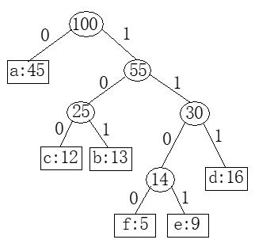
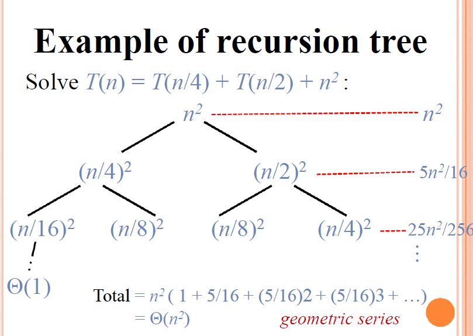

#### 10 摊还分析

**聚合分析**：一个 $n$ 个操作的序列最坏情况下花费的总时间是 $T(n)$ ，那么每个操作的摊还代价为 $T(n)/n$

例1：一个初值为 $0$ 的 $k$ 位计数器执行 $n$ 个插入操作的翻转总数为：
$$
\sum\limits_{i=0}^{k-1}\lfloor \frac{n}{2^i} \rfloor < n \sum\limits_{i=0}^{\infty} \frac{1}{2^i} = 2n
$$
其中，$i$ 表示从低位开始的位数，每 $n$ 个插入最坏情况为 $O(n)$，单次插入平均（摊还）代价为 $O(n)/n=O(1)$

例2：对一个动态表执行 $n$ 次插入操作，第 i 次的代价为：
$$
c_i=
\begin{cases}
i& i-1等于2的幂\\
1& 其他
\end{cases}
$$
因此，n 次总代价为：
$$
\sum\limits^n_{i=1}c_i \le \sum\limits^{\lfloor lgn \rfloor}_{j=0}2^j < n+2n=3n
$$


**核算法**：

对不同的操作赋予不同的费用，赋予某些操作的费用可能多于或少于其实际代价，将赋予一个操作的费用称为他的摊还代价。当一个操作的摊还代价超过其实际代价时，将多出的差额存储，称为信用；当摊还代价小于实际代价时，用信用支付差额。

将第 $i$ 次操作的摊还代价记为 $\hat{c}_i$ ，其实际代价记为 $c_i$，要求：
$$
\sum\limits^n_{i=1}\hat{c}_i \ge \sum\limits^n_{i=1}c_i
$$
例1：

例2：


**势能法**：

$\Phi$ 

例2：


#### 13 线性规划

**标准型**
$$
\begin{align}
max \quad &\sum\limits_{j=1}^nc_j x_j &\\
s.t. \quad &\sum\limits_{j=1}^n a_{ij} x_j \le b_i, \quad &i=1,2,...,m\\
& \qquad\quad  x_j \ge 0, \quad &j=1,2,...,m
\end{align}
$$

1. 目标函数是 $min f(x)$ ，转换为 $max (-f(x))$ 
2. 变量 $x_j$ 无非负约束，用 $x_j'-x_j''$ 替换 $x_j$，并增加非负约束 $x_j'\ge0,x_j''\ge0$
3. 等式约束 $\alpha_ix=b_i$，转换为 $\alpha_ix \ge b_i,\alpha_ix\le b_i$
4. 大于等于号，两边加负号变成小于等于

**松弛型**

对 $\sum\limits_{j=1}^n a_{ij} x_j \le b_i$，加入新的约束 $s$ （做题时一般用新的 $x_i$）：
$$
\begin{align}
s &= b_i - \sum\limits_{j=1}^n a_{ij} x_j \\
s &\ge 0
\end{align}
$$


**单纯形法**

​	根据目标函数变量的系数（正的、最大的）决定操作哪个哪个

​	在约束条件中，令其他变量都为零，找到这个变量的最紧的值，以确定旋转用哪个约束条件

​	找到这个约束条件后，将这个参数换到左边，用原来的非基本变量表示

​	再将这个约束条件带入目标函数，这样在目标函数中会出现一个正常量

重复，直到目标函数变量的系数全为负


#### 14 快速傅里叶变换

Python 代码

```python
from math import sin, cos, pi

class Complex:

    def __init__(self, r, i):
        self.r = r
        self.i = i
    
    def __add__(self, rhs):
        r = self.r + rhs.r
        i = self.i + rhs.i
        return Complex(r, i)

    def __sub__(self, rhs):
        r = self.r - rhs.r
        i = self.i - rhs.i
        return Complex(r, i)

    def __mul__(self, rhs):
        r = (self.r * rhs.r) - (self.i * rhs.i)
        i = self.r * rhs.i + self.i * rhs.r
        return Complex(r, i)


def fft(arr):
    n = len(arr)
    if n == 1:
        return arr
    
    wn = Complex(cos(2*pi/n), sin(2*pi/n))
    w = Complex(1, 0)

    a0 = list()
    a1 = list()
    for i in range(0, n, 2):
        a0.append(arr[i])
        a1.append(arr[i+1])

    y0 = fft(a0)
    y1 = fft(a1)

    ya = list()
    yb = list()
    for k in range(0, n>>1):
        ya.append(y0[k] + w*y1[k])
        yb.append(y0[k] - w*y1[k])
        w = w * wn
    
    for i in yb:
        ya.append(i)
    
    return ya


x = [Complex(i, 0) for i in range(4)]
y = fft(x)
```

求解矩阵：

$$
\left[ \begin{matrix}
y_0\\
y_1\\
y_2\\
y_3\\
\vdots\\
y_{n-1}
\end{matrix} \right ]
=
\left[ \begin{matrix}
1 & 1   & 1   & 1   & \cdots & 1 \\
1 & w_n & w_n^2 & w_n^3 & \cdots & w_n^{n-1}\\
1 & w_n^2 & w_n^4 & w_n^6 & \cdots & w_n^{2(n-1)}\\
1 & w_n^3 & w_n^6 & w_n^9 & \cdots & w_n^{3(n-1)}\\
\vdots & \vdots &\vdots &\vdots& \ddots &\vdots\\
1 & w_n^{n-1} & w_n^{2(n-1)} & w_n^{3(n-1)} & \cdots & w_n^{(n-1)(n-1)}\\
\end{matrix} \right ]
\left[ \begin{matrix}
a_0\\
a_1\\
a_2\\
a_3\\
\vdots\\
a_{n-1}
\end{matrix} \right ]
,w_n = cos(2\pi/n) + i\cdot sin(2\pi/n)
$$

$F_1 = [1]$

$F_2
=
\left[ \begin{matrix}
1 & 1 \\
1 & -1 \\
\end{matrix} \right ]$

$F_4
=
\left[ \begin{matrix}
1 & 1 & 1  & 1 \\
1 & i & -1 & -i\\
1 & -1 & 1 & -1\\
1 & -i & -1 & i\\
\end{matrix} \right ]$


#### 12 贪心

**贪心性质：**

* 贪心选择性质（greedy-choice property）
* 最优子结构（optimal substructure）

**例1：活动选择问题**

* 定理：任意非空子问题 $S_k$ ，令 $a_m$ 是 $S_k$ 中结束时间最早额活动，则 $a_m$ 在 $S_k$ 的某个最大兼容子活动中。

  证明：设 $A_k$ 是一个最大兼容活动子集，$a_j$ 是结束时间最早的活动。若 $a_m = a_j$，则 $a_m \in A_k$，显然成立；否则，令 $A'_k=(A_k-\{a_j\})\cup\{a_m\}$，由于 $f_m \le f_j$，所以 $A'_k$ 中的元素也是不相交的，又 $|A'_k|=|A_k|$ ，故 $A'_k$ 也是一个最大兼容活动子集。

* 最早结束的活动，最晚开始的活动

**例2：分数背包问题**

**例3：哈夫曼编码 **

前缀码：没有任何码字是其他码字的前缀

哈夫曼过程：取两个最小的元素，生成一个新节点，路径上编码 0 和 1，直到构成一棵树（用优先队列实现复杂度 $O(nlogn)$ ）

* 记号：$freq$ 频率；$d_T$ 在树中的深度，码长；$T$ 编码树；$B$ 代价，编码所有字符的代码位数

* 引理1（贪心选择性）：$x$， $y$ 是频率最低的两个字符，则存在一个最优前缀码，使得 $x$ 和 $y$ 的码字长度相同，且只有最后一位不同

  证明：即证xy是深度最深的兄弟节点

  设x，y是频率最低的两个字符，假设最优前缀码中最长的两个字符为a，b（则a，b在树中的深度最深且相同的兄弟）。不失一般性，假设频率x小于y，a小于b；由于x，y是频率最低的，故x小于a，y小于b。

  若频率x等于b，则x=y=a=b，即x=a，y=b，显然成立

  若x小于b，可以交换a和x得到T‘，再交换b和y得到T’‘，通过树的总代价 $B = \sum\limits_{c \in C}c.freq \cdot d_T(c)$，计算$B(T)-B(T')$ 和 $B(T’)-B(T'')$ 得到两者均非负，从而得到 $B(T) \ge B(T'')$ ，由于 $B(T)$ 是最优的，所以 $B(T) = B(T'')$，得证

* 引理2（最优子结构）：$x$，$y$ 是频率最低的两个字符，可以将 $x$，$y$ 生成的 $z$ 替换为一个以 $x$，$y$ 为孩子的内部节点，则可以得到一棵树 $T$，$T$ 是最优前缀码

  证明：即证用这个过程构造出来的哈夫曼树一定是代价最小的。

  $T'$是一个最优前缀码的编码树，将其叶子结点 $z$ 替换为有两个孩子 $x$ 和 $y$ 的内部节点，得到 $T$，则 $T$ 也是一个最优前缀码
  $$
  \begin{align}
  x.freq \cdot d_T(x) + y.freq \cdot d_T(y) & = (x.freq+y.freq) \cdot (d_{T'}(z) +1) \\
  & = (x.freq+y.freq) \cdot d_{T'}(z) + (x.freq+y.freq) \\
  & = z.freq \cdot d_{T'}(z) + (x.freq+y.freq)
  \end{align}
  $$
  所以$B(T)=B(T')+(x.freq+y.freq)$，或 $B(T')=B(T)-(x.freq+y.freq)$

  反证：若 $T$ 不是最优前缀码，则存在最优的 $T''$ 满足 $B(T'') < B(T)$，用 $T'''$ 表示将 $T''$ 中最低频 $x,y$ 替换为 $z$ 得到的最优前缀码，则：$B(T''') = B(T'')-(x.freq+y.freq) < B(T)-(x.freq+y.freq) < B(T')$ ，与假设 $T'$是一个最优前缀码的编码树 矛盾

* 定理：哈夫曼过程可以生成一个最优前缀码

  证明：由引理1、引理2可证



#### 11 DP

DP性质：

* 最优子结构
* 重叠子问题（overlapping subproblems）

例1：矩阵链乘法

例2：最长公共子序列

例3：三角剖分

例4：0-1背包

例5：最小编辑距离

例6：最大单位阵


#### 2 递归分治，时间复杂度

分析时间复杂度：最坏时间复杂度（最大值，最常用），平均时间复杂度（期望值，有时用）


形式化定义：$\Theta(g(n))$、$O(g(n))$、$o(g(n))$、$\Omega(g(n))$、$\omega(g(n))$


运行时间至多是 $O(g(n))$，运行时间至少是 $\Omega(g(n))$


若 $f(n)=o(g(n))$，称 $f(n)$ **渐近小于** $g(n)$

若 $f(n)=\omega(g(n))$，称 $f(n)$ **渐近大于** $g(n)$

*补充：*$f(n)$ **多项式大于** $g(n)$：存在常数 $\epsilon>0$，使得 $f(n)= \Omega(g(n) \cdot n^{\epsilon})$


递归时间复杂度：代入法、递归树、主方法

**代入法**：

* 猜测解的形式
* 数学归纳求出常数


**递归树法**：$T(n)=\sum a_iT(n/b_i)+f(n)$ 

* 确定每层的贡献（一般是个等比数列 *geometric series*）
* 确定递归树的高度 $log_qn$（数列长度，$q^h = n$，$q$ 是最小的 $b_i$）
* 确定叶子的代价，叶子数为 $n^{log_b a}$（树是满的情况下 ，或估计成最小的 $b_i$）

例：$T(n) = T(n/4) + T(n/2) + n^2$

这个和一定小于 $n^2 \sum\limits_i^{\infty}(\frac{5}{16})^i =n^2  \frac{1-(5/16)^\infty}{1-5/16} \to \frac{n^2 }{1-5/16} $ 



**主方法**：

令 $a \ge 1$ 和 $b \ge 1$ 是常数，$f(n)$ 是一个函数，$T(n)$ 是定义在非负整数上的递归式：$T(n)=aT(n/b)+f(n)$ 。（$n/b$ 可以是向上或向下取整）

1. 若对某个常数 $\epsilon>0$，有 $f(n)=O(n^{log_b a - \epsilon})$，则 $T(n)=\Theta(n^{log_b a})$。即 $f(n) < n^{log_b a}$
2. 若 $f(n)=\Theta(n^{log_b a})$，则 $T(n)=\Theta(n^{log_b a}lgn)$。即 $f(n) = n^{log_b a}$
3. 若对某个常数 $\epsilon>0$，有 $f(n)=\Omega(n^{log_b a + \epsilon})$，且对某个常数 $c<1$ 以及所有足够大的 $n$，有 $af(n/b)\le cf(n)$，则 $T(n)=\Theta(f(n))$。即 $f(n) > n^{log_b a}$

上述 3 种情况不能覆盖 $f(n)$ 的所有可能，有以下三种可能：

1. 非多项式可比：

   对 1 和 2，$f(n) < n^{log_b a}$ 但不是多项式意义的小于

   对 2 和 3，$f(n) > n^{log_b a}$ 但不是多项式意义的大于

   例如：$f(n)=nlgn$，$n^{log_b a}=n$（这种情况貌似只出现在给你的 $f(n)$ 不是多项式的时候）

2. 不满足 3 的附加条件

*补充*：如果 $f(n)=\Theta(n^{log_b a}lg^kn)$，其中 $k \ge 0$ ，那么 $T(n)=\Theta(n^{log_b a}lg^{k+1}n)$


例1：大数乘法

例2：STRASSEN矩阵

例3：棋盘覆盖


#### 3 排序

决策树证明排序算法的下界：$O(nlgn)$

 

线性时间排序：计数排序、基数排序、桶排序


