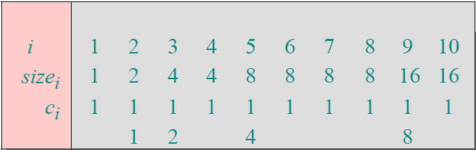
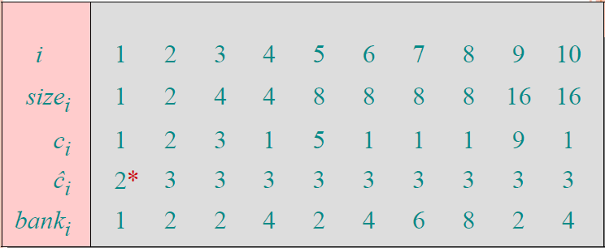
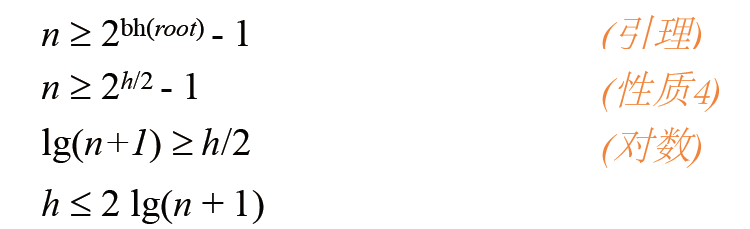
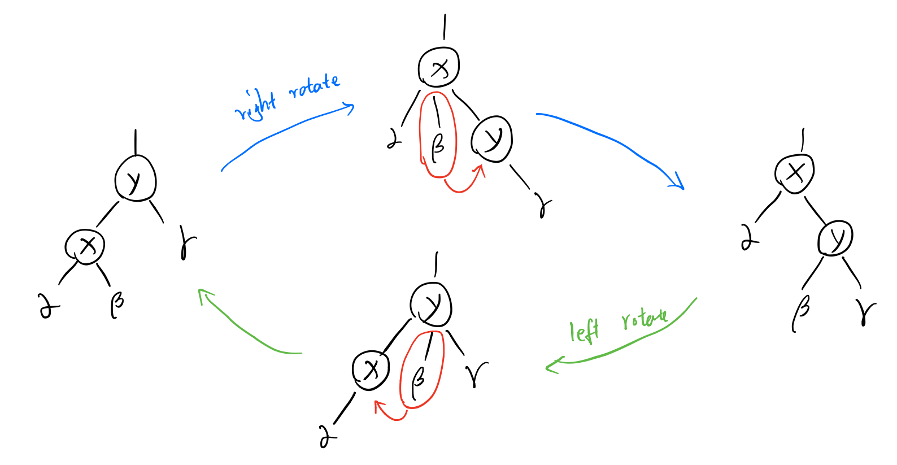
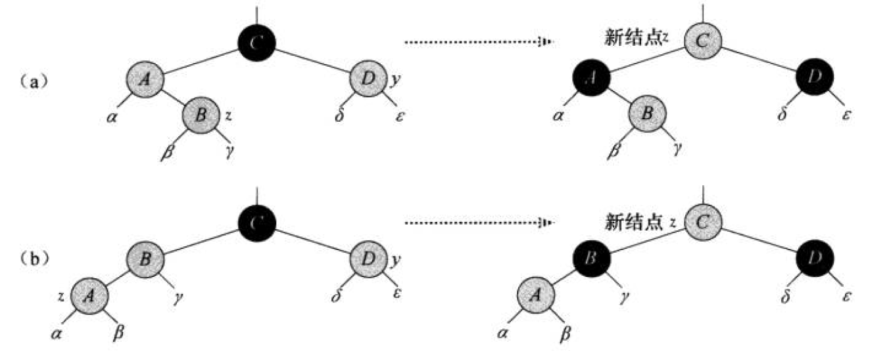
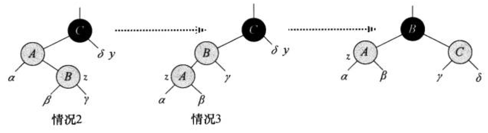
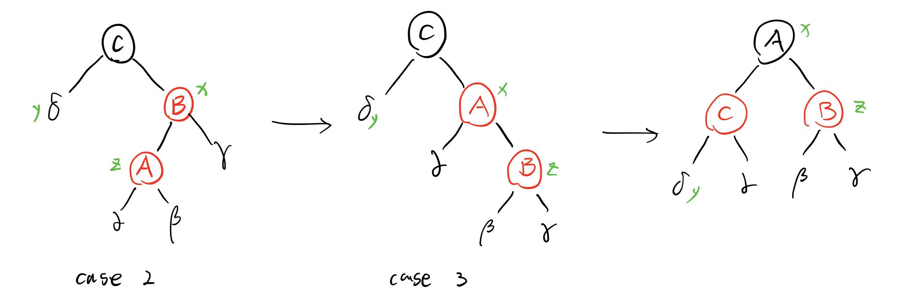
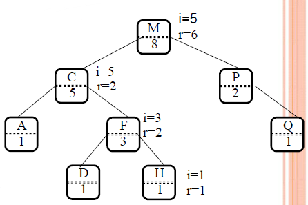
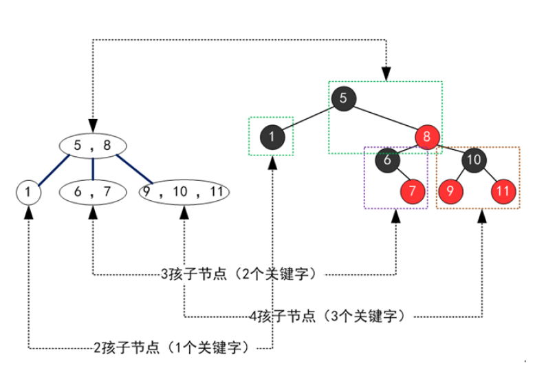

#### 10 摊还分析

**聚合分析**：一个 $n$ 个操作的序列最坏情况下花费的总时间是 $T(n)$ ，那么每个操作的摊还代价为 $T(n)/n$

例1：一个初值为 $0$ 的 $k$ 位计数器执行 $n$ 个插入操作的翻转总数为：
$$
\sum\limits_{i=0}^{k-1}\lfloor \frac{n}{2^i} \rfloor < n \sum\limits_{i=0}^{\infty} \frac{1}{2^i} = 2n
$$
其中，$i$ 表示从低位开始的位数，每 $n$ 个插入最坏情况为 $O(n)$，单次插入平均（摊还）代价为 $O(n)/n=O(1)$

例2：对一个动态表执行 $n$ 次插入操作，第 i 次的代价为：
$$
c_i=
\begin{cases}
i& i-1等于2的幂\\
1& 其他
\end{cases}
$$
因此，n 次总代价为：
$$
\sum\limits^n_{i=1}c_i \le \sum\limits^{\lfloor lgn \rfloor}_{j=0}2^j < n+2n=3n
$$


***所谓聚合分析就是求和，然后除以 n 表示均摊到每一次操作上***


**核算法**：

对不同的操作赋予不同的费用，赋予某些操作的费用可能多于或少于其实际代价，将赋予一个操作的费用称为他的摊还代价。当一个操作的摊还代价超过其实际代价时，将多出的差额存储，称为信用；当摊还代价小于实际代价时，用信用支付差额。

将第 $i$ 次操作的摊还代价记为 $\hat{c}_i$ ，其实际代价记为 $c_i$，要求：
$$
\sum\limits^n_{i=1}\hat{c}_i \ge \sum\limits^n_{i=1}c_i
$$
例1：

例2：



***核方法，可以用聚合法求出来然后硬掰***


**势能法**：

与整个操作序列相关的，定义 $D_i$ 为对数据结构 $D_{i-1}$ 做第i次操作后的结果，即记录总的存款额。对比记账法，记账法为记录每一次流水，势能则只记录总的存款额。

$\Phi$ 

例2：


***难点在于定义势能函数***

#### 13 线性规划

**标准型**
$$
\begin{align}
max \quad &\sum\limits_{j=1}^nc_j x_j &\\
s.t. \quad &\sum\limits_{j=1}^n a_{ij} x_j \le b_i, \quad &i=1,2,...,m\\
& \qquad\quad  x_j \ge 0, \quad &j=1,2,...,m
\end{align}
$$

1. 目标函数是 $min f(x)$ ，转换为 $max (-f(x))$ 
2. 变量 $x_j$ 无非负约束，用 $x_j'-x_j''$ 替换 $x_j$，并增加非负约束 $x_j'\ge0,x_j''\ge0$
3. 等式约束 $\alpha_ix=b_i$，转换为 $\alpha_ix \ge b_i,\alpha_ix\le b_i$
4. 大于等于号，两边加负号变成小于等于

**松弛型**

对 $\sum\limits_{j=1}^n a_{ij} x_j \le b_i$，加入新的约束 $s$ （做题时一般用新的 $x_i$）：
$$
\begin{align}
s &= b_i - \sum\limits_{j=1}^n a_{ij} x_j \\
s &\ge 0
\end{align}
$$


**单纯形法**

​	根据目标函数变量的系数（正的、最大的）决定操作哪个哪个

​	在约束条件中，令其他变量都为零，找到这个变量的最紧的值，以确定旋转用哪个约束条件

​	找到这个约束条件后，将这个参数换到左边，用原来的非基本变量表示

​	再将这个约束条件带入目标函数和其他的约束，这样在目标函数中会出现一个正常量

重复，直到目标函数变量的系数全为负


**辅助线性规划**

可以找到一个可行解

max -x0

标准型中每项约束左边都减掉一个 x0，化为辅助松弛型处理负的约束，可以求出一个可行解（包括x0）。将x0的可行解带入到目标函数和约束，即可求解。


#### 14 快速傅里叶变换

Python 代码

```python
from math import sin, cos, pi

class Complex:

    def __init__(self, r, i):
        self.r = r
        self.i = i
    
    def __add__(self, rhs):
        r = self.r + rhs.r
        i = self.i + rhs.i
        return Complex(r, i)

    def __sub__(self, rhs):
        r = self.r - rhs.r
        i = self.i - rhs.i
        return Complex(r, i)

    def __mul__(self, rhs):
        r = (self.r * rhs.r) - (self.i * rhs.i)
        i = self.r * rhs.i + self.i * rhs.r
        return Complex(r, i)


def fft(arr):
    n = len(arr)
    if n == 1:
        return arr
    
    wn = Complex(cos(2*pi/n), sin(2*pi/n))
    w = Complex(1, 0)

    a0 = list()
    a1 = list()
    for i in range(0, n, 2):
        a0.append(arr[i])
        a1.append(arr[i+1])

    y0 = fft(a0)
    y1 = fft(a1)

    ya = list()
    yb = list()
    for k in range(0, n>>1):
        ya.append(y0[k] + w*y1[k])
        yb.append(y0[k] - w*y1[k])
        w = w * wn
    
    for i in yb:
        ya.append(i)
    
    return ya


x = [Complex(i, 0) for i in range(4)]
y = fft(x)
```

求解矩阵：

$$
\left[ \begin{matrix}
y_0\\
y_1\\
y_2\\
y_3\\
\vdots\\
y_{n-1}
\end{matrix} \right ]
=
\left[ \begin{matrix}
1 & 1   & 1   & 1   & \cdots & 1 \\
1 & w_n & w_n^2 & w_n^3 & \cdots & w_n^{n-1}\\
1 & w_n^2 & w_n^4 & w_n^6 & \cdots & w_n^{2(n-1)}\\
1 & w_n^3 & w_n^6 & w_n^9 & \cdots & w_n^{3(n-1)}\\
\vdots & \vdots &\vdots &\vdots& \ddots &\vdots\\
1 & w_n^{n-1} & w_n^{2(n-1)} & w_n^{3(n-1)} & \cdots & w_n^{(n-1)(n-1)}\\
\end{matrix} \right ]
\left[ \begin{matrix}
a_0\\
a_1\\
a_2\\
a_3\\
\vdots\\
a_{n-1}
\end{matrix} \right ]
,w_n = cos(2\pi/n) + i\cdot sin(2\pi/n)
$$

$F_1 = [1]$

$F_2
=
\left[ \begin{matrix}
1 & 1 \\
1 & -1 \\
\end{matrix} \right ]$

$F_4
=
\left[ \begin{matrix}
1 & 1 & 1  & 1 \\
1 & i & -1 & -i\\
1 & -1 & 1 & -1\\
1 & -i & -1 & i\\
\end{matrix} \right ]$


#### 12 贪心

**贪心性质：**

* 贪心选择性质（greedy-choice property）
* 最优子结构（optimal substructure）

**例1：活动选择问题**

* 定理：任意非空子问题 $S_k$ ，令 $a_m$ 是 $S_k$ 中结束时间最早额活动，则 $a_m$ 在 $S_k$ 的某个最大兼容子活动中。

  证明：设 $A_k$ 是一个最大兼容活动子集，$a_j$ 是结束时间最早的活动。若 $a_m = a_j$，则 $a_m \in A_k$，显然成立；否则，令 $A'_k=(A_k-\{a_j\})\cup\{a_m\}$，由于 $f_m \le f_j$，所以 $A'_k$ 中的元素也是不相交的，又 $|A'_k|=|A_k|$ ，故 $A'_k$ 也是一个最大兼容活动子集。

* 最早结束的活动，最晚开始的活动

**例2：分数背包问题**

**例3：哈夫曼编码 **

前缀码：没有任何码字是其他码字的前缀

哈夫曼过程：取两个最小的元素，生成一个新节点，路径上编码 0 和 1，直到构成一棵树（用优先队列实现复杂度 $O(nlogn)$ ）

* 记号：$freq$ 频率；$d_T$ 在树中的深度，码长；$T$ 编码树；$B$ 代价，编码所有字符的代码位数

* 引理1（贪心选择性）：$x$， $y$ 是频率最低的两个字符，则存在一个最优前缀码，使得 $x$ 和 $y$ 的码字长度相同，且只有最后一位不同

  证明：即证xy是深度最深的兄弟节点

  设x，y是频率最低的两个字符，假设最优前缀码中最长的两个字符为a，b（则a，b在树中的深度最深且相同的兄弟）。不失一般性，假设频率x小于y，a小于b；由于x，y是频率最低的，故x小于a，y小于b。

  若频率x等于b，则x=y=a=b，即x=a，y=b，显然成立

  若x小于b，可以交换a和x得到T‘，再交换b和y得到T’‘，通过树的总代价 $B = \sum\limits_{c \in C}c.freq \cdot d_T(c)$，计算$B(T)-B(T')$ 和 $B(T’)-B(T'')$ 得到两者均非负，从而得到 $B(T) \ge B(T'')$ ，由于 $B(T)$ 是最优的，所以 $B(T) = B(T'')$，得证

* 引理2（最优子结构）：$x$，$y$ 是频率最低的两个字符，可以将 $x$，$y$ 生成的 $z$ 替换为一个以 $x$，$y$ 为孩子的内部节点，则可以得到一棵树 $T$，$T$ 是最优前缀码

  证明：即证用这个过程构造出来的哈夫曼树一定是代价最小的。

  $T'$是一个最优前缀码的编码树，将其叶子结点 $z$ 替换为有两个孩子 $x$ 和 $y$ 的内部节点，得到 $T$，则 $T$ 也是一个最优前缀码
  $$
  \begin{align}
  x.freq \cdot d_T(x) + y.freq \cdot d_T(y) & = (x.freq+y.freq) \cdot (d_{T'}(z) +1) \\
  & = (x.freq+y.freq) \cdot d_{T'}(z) + (x.freq+y.freq) \\
  & = z.freq \cdot d_{T'}(z) + (x.freq+y.freq)
  \end{align}
  $$
  所以$B(T)=B(T')+(x.freq+y.freq)$，或 $B(T')=B(T)-(x.freq+y.freq)$

  反证：若 $T$ 不是最优前缀码，则存在最优的 $T''$ 满足 $B(T'') < B(T)$，用 $T'''$ 表示将 $T''$ 中最低频 $x,y$ 替换为 $z$ 得到的最优前缀码，则：$B(T''') = B(T'')-(x.freq+y.freq) < B(T)-(x.freq+y.freq) < B(T')$ ，与假设 $T'$是一个最优前缀码的编码树 矛盾

* 定理：哈夫曼过程可以生成一个最优前缀码

  证明：由引理1、引理2可证


#### 11 DP

DP性质：

* 最优子结构（optimal substructure）

  A problem exhibits Optimal substructure if an optimal solution to the problem is contained within its optimal solutions to subproblems.

* 重叠子问题（overlapping subproblems）

  When a recursive algorithm revisits the same problem over and over again, we say that the optimization problem has Overlapping subproblems

例1：矩阵链乘法

例2：最长公共子序列

例3：三角剖分

例4：0-1背包

例5：最小编辑距离

例6：最大单位阵


#### 2 递归分治，时间复杂度

分析时间复杂度：最坏时间复杂度（最大值，最常用），平均时间复杂度（期望值，有时用）


形式化定义：$\Theta(g(n))$、$O(g(n))$、$o(g(n))$、$\Omega(g(n))$、$\omega(g(n))$


运行时间至多是 $O(g(n))$，运行时间至少是 $\Omega(g(n))$


若 $f(n)=o(g(n))$，称 $f(n)$ **渐近小于** $g(n)$

若 $f(n)=\omega(g(n))$，称 $f(n)$ **渐近大于** $g(n)$

*补充：*$f(n)$ **多项式大于** $g(n)$：存在常数 $\epsilon>0$，使得 $f(n)= \Omega(g(n) \cdot n^{\epsilon})$


递归时间复杂度：代入法、递归树、主方法

**代入法**：

* 猜测解的形式
* 数学归纳求出常数


**递归树法**：$T(n)=\sum a_iT(n/b_i)+f(n)$ 

* 确定每层的贡献（一般是个等比数列 *geometric series*）
* 确定递归树的高度 $log_qn$（数列长度，$q^h = n$，$q$ 是最小的 $b_i$）
* 确定叶子的代价，叶子数为 $n^{log_b a}$（树是满的情况下 ，或估计成最小的 $b_i$）

例1：$T(n) = T(n/4) + T(n/2) + n^2$

这个和一定小于 $n^2 \sum\limits_i^{\infty}(\frac{5}{16})^i =n^2  \frac{1-(5/16)^\infty}{1-5/16} \to \frac{n^2 }{1-5/16} $ ，所以 $O(n^2)$

另外，可以通过原式得出 $T(n) = T(n/4) + T(n/2) + n^2 \ge cn^2 = \Omega(n^2)$

可以得到紧确界 $\Theta(n^2)$

例2：$T(n) = T(n/3) + T(2n/3) + cn$

这个题目可以通过最长路径分支和最短路径分支都在 $nlgn$ 上证明


**主方法**：

令 $a \ge 1$ 和 $b \ge 1$ 是常数，$f(n)$ 是一个函数，$T(n)$ 是定义在非负整数上的递归式：$T(n)=aT(n/b)+f(n)$ 。（$n/b$ 可以是向上或向下取整）

1. 若对某个常数 $\epsilon>0$，有 $f(n)=O(n^{log_b a - \epsilon})$，则 $T(n)=\Theta(n^{log_b a})$。即 $f(n) < n^{log_b a}$
2. 若 $f(n)=\Theta(n^{log_b a})$，则 $T(n)=\Theta(n^{log_b a}lgn)$。即 $f(n) = n^{log_b a}$
3. 若对某个常数 $\epsilon>0$，有 $f(n)=\Omega(n^{log_b a + \epsilon})$，且对某个常数 $c<1$ 以及所有足够大的 $n$，有 $af(n/b)\le cf(n)$，则 $T(n)=\Theta(f(n))$。即 $f(n) > n^{log_b a}$

上述 3 种情况不能覆盖 $f(n)$ 的所有可能，有以下三种可能：

1. 非多项式可比：

   对 1 和 2，$f(n) < n^{log_b a}$ 但不是多项式意义的小于

   对 2 和 3，$f(n) > n^{log_b a}$ 但不是多项式意义的大于

   例如：$f(n)=nlgn$，$n^{log_b a}=n$（这种情况貌似只出现在给你的 $f(n)$ 不是多项式的时候）

2. 不满足 3 的附加条件

*补充*：如果 $f(n)=\Theta(n^{log_b a}lg^kn)$，其中 $k \ge 0$ ，那么 $T(n)=\Theta(n^{log_b a}lg^{k+1}n)$


例1：大数乘法

例2：STRASSEN矩阵

例3：棋盘覆盖


#### 3 排序

决策树证明比较排序算法的下界：$\Omega(nlgn)$

==证明==：考虑一棵高度为 $h$、具有 $l$ 个可达叶节点的决策树的决策树，对输入规模为 $n$ 的数据，就有 $n!$ 种排列可能是叶节点，所以有 $n! \le l$；同时，由于在一棵高为 $h$ 的二叉树中，叶节点的数目不多于 $2^h$，故 $n! \le l \le 2^h$。对不等式两边取以 $2$ 为底的对数，有：

$n!=\sqrt{2\pi n} ( \frac{n}{e})^n(1+\theta(\frac{1}{n})) > (\frac{n}{e})^n$

$h \ge lg(n!) = nlgn-nlge = \Omega(nlgn)$

*我觉得可以这样吧*： $h \ge lg(n!) = \sum\limits^n_i lg(i) = \Omega(nlgn)$


线性时间排序：计数排序、基数排序、桶排序

计数排序：稳定的。受限于元素值的规模

* 初始化 C 为 0

* 计算 A 中每个元素的个数填到 C 中
* C [i] += C[i-1]
* 计算 B ，B[C[A[j] ] ] = A[j]，C[A[j] ] -- （其实可以直接写出 B 来，而计算完 B 的 C 的值就是 B 对应 A 值的位置减1

基数排序：稳定与否取决于对每个位排序的辅助排序函数是否稳定

* 先排低位，后排高位

桶排序

分析期望时间


基数排序的稳定度应该取决于辅助排序算法


#### 4 哈希

**链接法**（考查哈希过程和证明）

*（链表中新来的放在前面）*

定义一个能存放 $n$ 个元素，具有 $m$ 个槽位的散列表 $T$ ，定义装载因子 $\alpha = n/m$ ，即一个链的平均储存元素数。

定理：在简单均匀散列假设下，使用链接法，一次**不成功**查找的平均时间为 $\Theta(1+\alpha)$

==证明==： 一次不成功的查找平均要检查 $\alpha$ 个元素，还有计算槽（slot）的时间 $1$

定理：在简单均匀散列假设下，使用链接法，一次**成功**查找的平均时间为 $\Theta(1+\alpha)$

==证明==：


**散列函数**（考查设计）

* 除法：$h(k)=k\%m$

  $m$ 是散列表长，一般取一个不太接近 2 的幂的素数；$k$ 是关键字

* 乘法：$h(k)=\lfloor m(kA\%1) \rfloor$

  $kA\%1$ 表示小数部分，$A$ 是一个 0 到 1 之间的常数，$m$ 随意，一般取 2 的幂


**开放寻址**（考查哈希过程和证明）

* 线性探查：$h(k,i)=(h'(k) + i)\%m$
* 二次探查：$h(k,i)=(h'(k) + c_1i + c_2i^2)\%m$
* 双重散列：$h(k,i)=(h_1(k) + ih_2(k))\%m$

定理：在简单均匀散列假设下，使用开放地址法，一次**不成功**查找的期望查找次数至多为 $1/(1-\alpha)$

==证明==：定义事件 $A_i$ 为第 $i$ 次探测，且探测到被占用的槽，事件 $\{X \ge i\}$ 为 $A_1$ 到 $A_{i-1}$ 的交集，则概率 
$$
\begin{align}
\mathcal{P}\{X \ge i\} & = \mathcal{P}\{ A_1 \} \cdot \mathcal{P}\{A_2|A_1\}\cdot\mathcal{P}\{A_3|A_1\cap A_2\}\cdot...\cdot\mathcal{P}\{A_{i-1}|A_1\cap...\cap A_{i-2}\} \\ 
& = \frac{n}{m}\cdot\frac{n-1}{m-1}\cdot\frac{n-2}{m-2}...\frac{n-i+2}{m-i+2} \\
& \le (\frac{n}{m})^{i-1} \\
& = \alpha^{i-1}
\end{align}
$$
 期望 $E(X) = \sum\limits_{i=1}^\infty \mathcal{P}\{X \ge i\} \le \sum\limits_{i=1}^\infty \alpha^{i-1} = \sum\limits_{i=0}^\infty \alpha^i = \frac{1}{1-\alpha}$

推论：插入一个元素至多需要 $1/(1-\alpha)$ 次探查

定理：在简单均匀散列假设下，使用开放地址法，一次**成功**查找的期望查找次数至多为 $\frac{1}{\alpha}ln\frac{1}{1-\alpha}$ *（ppt里没有这个）*


#### 5 BST

基本操作：

* 查找 $O(h)$

* 插入 $O(h)$

* 删除 $O(h)$
  - 若没有孩子，直接删掉
  - 若只有一个孩子，则用这个孩子取代自己
  - 若有两个孩子，把左子树转交给后继（在右子树最左边），用后继取代自己，相应地要调整右子树


* 后继 $O(h)$：右子树最左边的元素；若右子树为空，则往上找：假设要找 $x$ 的后继，$x$ 的父节点是 $y$ ，直到 $x$ 是 $y$ 的左子树，移动 $x$ 到 $y$ ，$y$ 到 $y$ 的父节点，那么这个 $y$ 就是原节点的后继。
* 前驱 $O(h)$：左子树最右边的元素；后面


* 最值 $O(h)$：树的最左边（小）和最右边（大）

遍历

* 先序遍历（根左右）
* 中序遍历（左根右）
* 后序遍历（左右根）

考点：写出三种遍历结果，根据两种遍历结果创建树，或者给你一种遍历结果和树的形状让你填数


二叉排序树：

与快排的比较：有相同的时间复杂度 $O(nlgn)$，快排是原址排序，不需要构建复杂的数据结构


随机构造二叉树

定理：$n$ 个互异结点的随机构造二叉树的平均（期望）高度是 $O(lgn)$

==证明==


#### 6 红黑树

二叉树扩展了属性 $color$

红黑树确保没有一条路径会比其他路径长出两倍

性质：

* 每个结点或是红色， 或是黑色（Every node is either red or black）
* 根是黑色（The root is always black）
* 叶是黑色（Every leaf (NULL pointer) is black）
* 若一个节点是红色，则它的两个子节点只能是黑色（If a node is red, both its children are black）
* 对每个节点，从该节点到其所有后代叶节点的简单路径上，均包含相同数目的黑节点（Every path from node to descendent leaf contains  the same number of black nodes）

黑高：从某个节点出发（不含该节点）达到一个叶节点（包含该叶节点）的任一简单路径上包含的黑色节点的数目是一样的，这个数目称为 *黑高* $bh(x)$；树的黑高为根节点的黑高

*区分树高 h 和黑高 bh，由性质4可知 bh 大于等于 h/2*


一个黑高为 $k$ 的红黑树，最多有 $2^{2k}-1$ 个内节点，最少有 $2^k-1$ 个内节点


**引理**：任一以 $x$ 为根的子树中至少包含 $2^{bh(x)}-1$ 个内部节点

==证明==：*（数学归纳）*若 $x$ 高度为 $0$，则 $x$ 是叶节点，以 $x$ 为根的子树包含 $2^{bh(x)}-1 = 2^0-1=0$ 个内部节点；考虑一个高度为正值（即非叶节点）且有两个孩子的内部节点 $x$，其两个子节点有黑高 $2^{bh(x)}$ 或 $2^{bh(x)}-1$*（取决于各自的颜色：若x为红，则两个孩子都 -1；若x为黑，则红孩子相同，黑孩子 -1）* 。由于 x 子节点的高度比 x 要低，所以可以**假设**每个子节点至少有 $2^{hb(x)-1}-1$ 个内部节点，于是 $x$ 至少包含 $(2^{hb(x)-1}-1)+(2^{hb(x)-1}-1)+1 = 2^{hb(x)}-1$ 个内部节点。 

**定理**：一个有 $n$ 个内部节点的红黑树的高度**至多**为 $2lg(n+1)$

==证明==：假设树高为 $h$，根据性质4*（若一个节点是红色，则它的两个子节点只能是黑色）*，一条简单路径上至少有一半的节点是黑色，因此黑高至少为 $h/2$。因此，由引理知，若内部节点为 $n$，则 $n\ge2^{h/2}-1$ ，整理取对数得到 $lg(n+1) \ge h/2$ ，或者 $h \le 2lg(n+1)$。过程如图：




**定理**：一个有 $n$ 个内部节点的红黑树的高度为 $O(lgn)$

==证明==：由上面的定理，我们已经知道 $h \le 2lg(n+1)$，显然 $h=O(lgn)$


基本操作：

* 旋转

  

  *（可以看成是把子节点提起来，把中间耷拉着的那个分支接到沉下去的节点上）*

  

  - 左旋：根和右子树
  - 右旋：根和左子树

  ```
  
  ```

  

* 插入

  - 先按二叉树的方法将新节点 z 放到正确的位置，并涂成红色

  - 如果 z 的父节点 x 是黑的，那没有问题；

  - 如果 z 的父节点 x 是红的，则需要调整：

    - 情况1：z 的叔叔 y 是红的

      则把父节点和叔节点涂黑，祖父节点涂红，z 的指针移到祖父上

      

    - 情况2：z 的叔叔 y 是是黑的，且 z 是一个右孩子

    - 情况3：z 的叔叔 y 是是黑的，且 z 是一个左孩子

      情况 2 可以通过对 x 和 z 做一次左旋变成情况 3，互换 x 和 z 指向的位置（z还是孩子）

      而后对 x 和 x 的父节点做旋转调整，如图：

      （**注意！** 图中这种情况是当 z 的父节点 x 是一个左孩子的时候）

      

      如果 z 的父节点 x 是一个右孩子，子树和旋转方向是相反的

      

  ```
  
  ```

  

* 删除（ppt里没有）


#### 7 扩张数据结构

**顺序统计树**

增加了 $size$ 属性，表示以 $x$ 为根的子树（包括 $x$）的**内**结点数。令叶节点大小为 0，则 $x.size = x.left.size+x.right.size+1$


例：找出第 $i$ 小的关键字 $x$

```
select(x, i):
	r = x.left.size + 1
	if i == r:
		return x
	elif i < r :
		return select(x.left, i)
    else:
    	return select(x.right, i - r)
```

即 $i < r$ 往左；$i > r$ 往右（顺带 $i=i-r$）



例：找出关键字 $x$ 在中序遍历的位置 $i$：

```
rank(T, x):
	r = x.left.size + 1
	y = x
	while y != T.root:
		if y == y.p.right:
			r = r + y.p.left.size + 1
		y = y.p
	return r
```


插入操作：新增节点的 $size$ 设为 1

旋转维护 $size$ ：

1. 现在的根（原来子节点）的 $size$ 设为 现在的子节点（原来根节点）的 $size$

2. 现在的子节点用公式求（上面也可以等这步求完再用公式求呀）

   *（麻烦，全都重新计算好了）*


**区间树**

属性 $int$ 区间，包含两个端点值： $low$ 和 $high$

属性 $max$ 子树（包含子树的根节点）中最大端点，$x.max=MAX(x.int.high,x.left.max,x.right.max)$


构造：中序遍历按左端点大小顺序排列，即 $x.int.left$ 作为 $key$

（考过从 0 构造一棵红黑区间树，插入）


例：查找与区间 $i$ 重叠的区间

```
search(T, i):
	x = T.root
	while x != T.nil and i does not overlap x.int:
		if x.left != T.nil and x.left.max >= i.low:
			x = x.left
		else:
			x = x.right
	return x
```


**树堆（$Treap$）**

看到18年考了。树堆就是在二叉树中加入了堆的性质——优先级（priority）。通过随机赋予一个节点一个优先级，通过优先级调整树，使得树是平衡的。前面证明了随机构造的二叉树期望高度是 $O(lgn)$

加入属性：$priority$ 按照 $x.priority$ 旋转树，小的 $priority$ 向上移


#### 8 B树

性质：

* 属性：
  - $x.n$ ：节点的大小（包含 $n$ 个关键字）
  - $x.key_i, i=1,2,...,x.n$ ：节点的 $n$ 个关键字
  - $x.leaf$ ：布尔值，是否是叶子

* 每个内部节点有 $n+1$ 个指向孩子节点的指针 $c_1,...,c_{x.n+1}$

* 两个指针指向的子节点中的任意值都小于和大于两个指针夹着的那个值

* 每个叶子深度相同，即树高 $h$ *（算法导论中高度和深度的基数都是 0）*

* 每个节点包含的关键字数量有上界和下界，用最小度数（minimum degree）$t \ge 2$ 来表示：

  - 除了根，每个节点至少含有 $t-1$ 个关键字

  - 每个节点至多包含 $2t-1$ 个关键字，故最多可有 $2t$ 个孩子

    

当 $t=2$ 时，称为 2-3-4 树

*2-3-4树与红黑树的等价性：*




定理：若 $n\ge1$，则对任意一棵包含 n 个关键字，高度为 h ，最小度数 t \ge 2 的 B 树，有 $h \le log_t\frac{n+1}{2}$ 

$h = O(log_tn)$


基本操作：

* 搜索 $O(tlog_tn)$

* 插入 $O(tlog_tn)$：满的时候按中间值分裂，将中间值上提到父节点。新的值只可能插入到叶节点（即最下层的实节点）中，上层的值是分裂才会加进去。树的高度的增长是根节点分裂实现的。

  在一次插入前，如果发现一个上层节点已经满了，先分裂（**而不是**插入值后递归向上地去分裂！）

* 删除（orz）

  - 如果在从上往下递归找 k 的过程中，发现存在 k 的那个子树（不一定是叶子）的根只有 t-1（下界）个节点，那么需要先补足到至少包含 t 个节点：（假设这个点是 y，不足 t-1 的子树为 z）
    - 如果 z 中的关键字数为 t-1，且存在相邻的兄弟有 t 个及以上的节点，则可以借用一下。把兄弟的节点的对应的值（在两端）移到 y 中相应位置，把 y 中相应的值移到 z 中；如果 z 和兄弟非叶子，那么需要在借的时候，要把兄弟的子树接到 z 上（因为兄弟少了一个值，会脱落一个子树）。
    - 如果 z 中的关键字数为 t-1，但是相邻的兄弟都是 t-1，那么把 z 和一个相邻的兄弟，以及取下两者夹着的 y 中的那个值，合并成一个节点。
  - 如果关键字 $k$ 在节点 $x$ 中，且 $x$ 是叶节点，并且已经处理完了上述的情况，则直接删
  - 如果关键字 $k$ 在 $x$ 中，且 $x$ 不是叶节点，则
    - 如果 k 处的“左子树” w 至少包含 t 个关键字，则从 w 中找到 k 的前驱 k' （子树中最靠右的），交换 k 和 k'，删掉 k
    - 如果 k 处的“右子树” w 至少包含 t 个关键字，则从 w 中找到 k 的后继 k' （子树中最靠左的），交换 k 和 k'，删掉 k
    - 如果 k 处的两个“子树”均只有 t-1 个关键字，则合并 k 和两个“子树”中的关键字以及两个指针，共得到含 2t-1 个关键字的新节点，删掉 k


#### 9 跳表

$n$ 个元素，$k$ 个有序链表的查询时间复杂度为 $k\cdot\sqrt[k]{n}$ ，$k=lgn$ 的话，复杂度为 $2lgn$


查找：

```c++
p=top
While(1){
    while (p->next->key < x ) p=p->next;
    If (p->down == NULL ) return p->next
    p=p->down ;
}
```

定理：有很大概率，跳表每次查询的时间花费为 $O(lgn)$

定理：有很大概率，$n$ 个元素的跳表有 $O(lgn)$ 层


插入：随机抛硬币来决定要不要在上层构建节点

```c++
int insert(val x){
 
    int i;
    int j = n; //n是当前表所拥有的level数
 
    cell *p[k]; //指针数组，用来保存每一层要插入元素的前驱
 
    cell *p1;
    p1 = top->next;
 
    while(p1){
        while(p1->next->val < x) p1=p1->next;
        if(j <= k){
            p[j-1] = p1; //保存每一层的指针
            p1 = p1->down; //指向下一层
            j--;
        }
    }
 
    //下面的代码是将x插入到各层
    for (i = 0; i<k; i++){
        if(p[i]==NULL){//k>n的情况，需要创建一个层
            //创建层的第一个元素，并将top指向它
            cell *elementhead = (cell *) malloc(sizeof(cell));
            element->val = -1;
            element->down = top;
            top = elementhead; 
 
            //创建最后一个元素
            cell *elementtail = (cell *) malloc(sizeof(cell));
            elementtail->val = 1;
            elementtail->next = elementtail->down = NULL;
 
            //在该层中创建并插入x
            cell *element = (cell *) malloc(sizeof(cell));
            element->val = x;
            elementhead->next = element;
            element->next = elementtail;
            element->down = p[i-1]->next;
        }
 
        //正常插入一个元素
        cell *element = (cell *) malloc(sizeof(cell));
        element->val = x;
        element->next = p[i]->next;
        element->down = (i=0?NULL:(p[i-1]->next));
        p[i]->next = element;
    }
 
    return 0;
}
```


删除：就把每层的这个点删掉，如果该层仅存在一个点了，就降层

```c++
int delete(val x){
 
    int i = n; //n表示当前总层数
    cell *p, *p1;
    p = top;
 
    while(n>0){
        while(p->next->val < x) p=p->next;
        if(p->next->val == x){//假如当前层存在节点x,删除
            if(p = top && p->next->next->val == INT_MAX){//该层只存在一个节点
                top = p->down;
                free(p->next->next);
                free(p->next);
                free(p);
                p = top;
            }
            else{
                p1 = p->next;
                p->next = p1->next;
                free(p1);
            }
        }
        p = p->down;
        n--;
    }
}
```

（[代码](https://blog.csdn.net/a2796749/article/details/48084717)仅参考）


