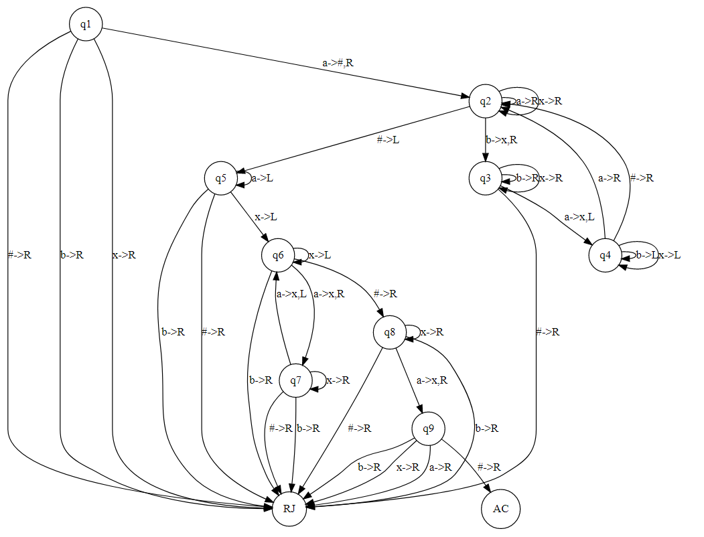

## Project 2

#### Goal

Design a Turing machine $M$ that decides a string a string that meets the following conditions $L = \{a^n b^m a^{(n+m)}|n,m \geq 1\}$, which describe the ordered string consisting of n $a$'s, m $b$'s, and (n+m) $a$'s.

#### Design

**At first**, we can split the string into three parts: 

* $a^n$, containing at least one $a$, and only consisting of $a$,
*  $b^m a^m$ ,containing at least one $b$ and at least one $a$ in order, 
* $a^n$, same number of $a$'s with the Part I.  

**Next**, we can describe the  Turing machine $M$ as following:

$M$ = "On input string $\omega$:  

1.  Scan the input from left to right to find where $b$ first appears.

2.  Cross off the $b$ and scan to the right until an $a$ occurs, and then cross off the $a$. Next, scan to the left until the first $a$ occurs, which means the pumping returns to where the first $b$ has appeared. In other word, $b$ and $a$ in $b^m a^m$ are crossed off in pair.
3. Scan the input to ensure Step 2 is finished, and return the head. Shuttle between $a^n$ of  Part I and Part III, and cross off the $a$ in pair.
4. If all elements are crossed off, $accept$; otherwise, $reject$. "

*Note, one more thing need to do is to check whether the string is a member of $a^+b^+a^+$, and $reject$ if it isn't. I didn't make extra judgments when coding, but it can be complete in the state transition.*

**Then**, we give the formal description of $M = (Q, \Sigma, \Gamma, \delta, q_1, q_{accept}, q_{reject})$:

* $Q = \{ q_1,q_2,q_3,q_4,q_5,q_6,q_7,q_8,q_9, q_{accept}, q_{reject} \}$,
* $\Sigma = \{ a, b \}$,
* $\Gamma = \{ a, b, \times, \sqcup \}$,

* $\delta$ described with a state diagram as following,
* The start, accept reject states are $q_1, q_{accept}$ and $ q_{reject}$.



*Note, in order to print clearly, I use sharp signal # to replace blank. And if the element does not change, the value of the edge is  written as  a pair like $(a,R)$ for short, instead of a tuple$(a,a,R)$.*

#### Result

Here, the input of the program is a string, and the outputs the sequence of configuration. And the input string contains positive and negative test cases. 

Positive test case 1:

input:

```
'abaa'
```

output

```
q1 a b a a #
# q2 b a a #
# x q3 a a #
# q4 x x a #
q4 # x x a #
# q2 x x a #
# x q2 x a #
# x x q2 a #
# x x a q2 #
# x x q5 a #
# x q5 x a #
# q6 x x a #
q6 # x x a #
# q8 x x a #
# x q8 x a #
# x x q8 a #
# x x x q9 #
# x x x # AC
```

Positive test case 2:

input:

```
'aabaaa'
```

output

```
q1 a a b a a a #
# q2 a b a a a #
# a q2 b a a a #
# a x q3 a a a #
# a q4 x x a a #
# q4 a x x a a #
# a q2 x x a a #
# a x q2 x a a #
# a x x q2 a a #
# a x x a q2 a #
# a x x a a q2 #
# a x x a q5 a #
# a x x q5 a a #
# a x q5 x a a #
# a q6 x x a a #
# q6 a x x a a #
# x q7 x x a a #
# x x q7 x a a #
# x x x q7 a a #
# x x q6 x x a #
# x q6 x x x a #
# q6 x x x x a #
q6 # x x x x a #
# q8 x x x x a #
# x q8 x x x a #
# x x q8 x x a #
# x x x q8 x a #
# x x x x q8 a #
# x x x x x q9 #
# x x x x x # AC
```

Positive test case 3:

input:

```
'abbaaa'
```

output

```
q1 a b b a a a #
# q2 b b a a a #
# x q3 b a a a #
# x b q3 a a a #
# x q4 b x a a #
# q4 x b x a a #
q4 # x b x a a #
# q2 x b x a a #
# x q2 b x a a #
# x x q3 x a a #
# x x x q3 a a #
# x x q4 x x a #
# x q4 x x x a #
# q4 x x x x a #
q4 # x x x x a #
# q2 x x x x a #
# x q2 x x x a #
# x x q2 x x a #
# x x x q2 x a #
# x x x x q2 a #
# x x x x a q2 #
# x x x x q5 a #
# x x x q5 x a #
# x x q6 x x a #
# x q6 x x x a #
# q6 x x x x a #
q6 # x x x x a #
# q8 x x x x a #
# x q8 x x x a #
# x x q8 x x a #
# x x x q8 x a #
# x x x x q8 a #
# x x x x x q9 #
# x x x x x # AC
```

Positive test case 4:

input:

```
'aabbaaaa'
```

output

```
q1 a a b b a a a a #
# q2 a b b a a a a #
# a q2 b b a a a a #
# a x q3 b a a a a #
# a x b q3 a a a a #
# a x q4 b x a a a #
# a q4 x b x a a a #
# q4 a x b x a a a #
# a q2 x b x a a a #
# a x q2 b x a a a #
# a x x q3 x a a a #
# a x x x q3 a a a #
# a x x q4 x x a a #
# a x q4 x x x a a #
# a q4 x x x x a a #
# q4 a x x x x a a #
# a q2 x x x x a a #
# a x q2 x x x a a #
# a x x q2 x x a a #
# a x x x q2 x a a #
# a x x x x q2 a a #
# a x x x x a q2 a #
# a x x x x a a q2 #
# a x x x x a q5 a #
# a x x x x q5 a a #
# a x x x q5 x a a #
# a x x q6 x x a a #
# a x q6 x x x a a #
# a q6 x x x x a a #
# q6 a x x x x a a #
# x q7 x x x x a a #
# x x q7 x x x a a #
# x x x q7 x x a a #
# x x x x q7 x a a #
# x x x x x q7 a a #
# x x x x q6 x x a #
# x x x q6 x x x a #
# x x q6 x x x x a #
# x q6 x x x x x a #
# q6 x x x x x x a #
q6 # x x x x x x a #
# q8 x x x x x x a #
# x q8 x x x x x a #
# x x q8 x x x x a #
# x x x q8 x x x a #
# x x x x q8 x x a #
# x x x x x q8 x a #
# x x x x x x q8 a #
# x x x x x x x q9 #
# x x x x x x x # AC
```

Negative test case 1:

input

```
'aaaa'
```

output

```
q1 a a a a #
# q2 a a a #
# a q2 a a #
# a a q2 a #
# a a a q2 #
# a a q5 a #
# a q5 a a #
# q5 a a a #
q5 # a a a #
# REJ a a a #
```

Negative test case 2:

input

```
'aaba'
```

output

```
q1 a a b a #
# q2 a b a #
# a q2 b a #
# a x q3 a #
# a q4 x x #
# q4 a x x #
# a q2 x x #
# a x q2 x #
# a x x q2 #
# a x q5 x #
# a q6 x x #
# q6 a x x #
# x q7 x x #
# x x q7 x #
# x x x q7 #
# x x x # RJ
```

Negative test case 3

input

```
'bbaa'
```

output

```
q1 b b a a #
b REJ b a a #
```

Negative test case 4

input

```
bbbb
```

output

```
q1 b b b b #
b REJ b b b #
```

Negative test case 5

input

```
ababa
```

output

```
q1 a b a b a #
# q2 b a b a #
# x q3 a b a #
# q4 x x b a #
q4 # x x b a #
# q2 x x b a #
# x q2 x b a #
# x x q2 b a #
# x x x q3 a #
# x x q4 x x #
# x q4 x x x #
# q4 x x x x #
q4 # x x x x #
# q2 x x x x #
# x q2 x x x #
# x x q2 x x #
# x x x q2 x #
# x x x x q2 #
# x x x q5 x #
# x x q6 x x #
# x q6 x x x #
# q6 x x x x #
q6 # x x x x #
# q8 x x x x #
# x q8 x x x #
# x x q8 x x #
# x x x q8 x #
# x x x x q8 #
# x x x x # RJ
```

