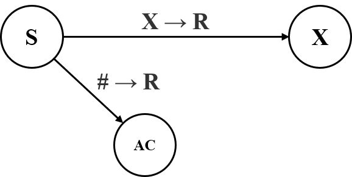
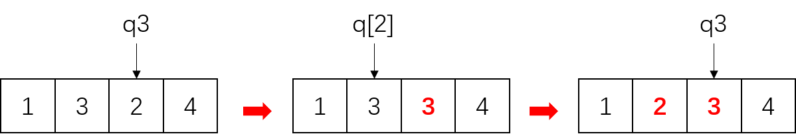
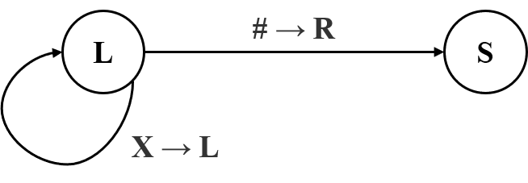
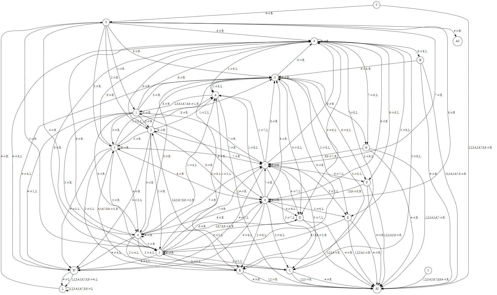
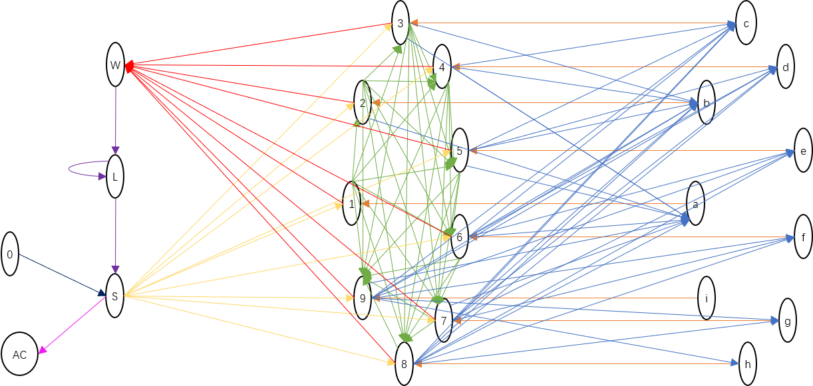

## Project 3

#### Experiment 1

**Goal**

Design a Turing Machine $M$ to implement the Bubble Sort.

**Design**

* **Number field ( $\Sigma$ )**

  To simplify the problem, let the number field $\Sigma$ be a subset of $\{x|1\le x \le 9\}$, For example, $\Sigma = \{1,3,4,6,9\}$ (without order) , the elements can be **dynamically** selected. Therefore, the number of states and state transforming diagram are different when selecting different subset. But in order to express the complete cases, I use the **universal** set, and of course, it can be any subset.

  In order to find the begin position and end position, add two sharp marks in the frond and back of the input number array. For example, the input number array is $[6,3,4,1,9]$ (with order), and after adding marks it is like: $[\#,6,3,4,1,9,\#]$. 

* **Bubble sort**

  The Bubble Sort can be described as following:

  ```
  BUBBLE_SORT( A )
  	for i <- 1 to A.length
  		for j <- 1 to A.length - i
  			if A[j] > A[j + 1]
  				swap(A[j], A[j + 1])
  			end-if
  		end-for
  	end-for
  ```

  The idea is in each iteration moving the maximum element to the back-most (in ascending order). Therefore, Turing machines need to be able to simulate this process.

* **State Transforming ( $\delta$ ) design**

  Let $q_0$ be the start state, and then we introduce three auxiliary states $q_S$, $q_W$ and $q_L$ to help complete state transforming. Besides, Let $q_1,q_2,q_3,q_4,q_5,q_6,q_7,q_8,q_9$ record states for corresponding value for each number in $\Sigma$, and use middle states $q_{[1]},q_{[2]},q_{[3]},q_{[4]},q_{[5]},q_{[6]},q_{[7]},q_{[8]},q_{[9]}$ to help swap two values when reverse order occurs, and the start, accept reject states are $q_0, q_{accept}$ and $ q_{reject}$. More details are as following:

  * **Start with $q_0$**

    

    

    When the Turing Machine starts, it will be initialized to state $q_0$, and if the next symbol on the tape is $\#$ (it must be $\#$, because we add it before input string) , then the state will transform to $q_S$, which means the machine is waiting to fetch a value to process.

  * **Fetch a value $X$**

    

    When the current state is $q_S$, if the next symbol is $\#$, it means the tape is sorted ( or an empty tape ), then the state transforms to $q_{accept}$. Otherwise, the next value must be a number, let it be $X$, so the machine can fetch this value and transform to corresponding state $q_X$.

  * **For each $q_X$ and $q_Y$，where $X$ and $Y$ are in $\Sigma$, and $X < Y$**

    

    When the current state is $q_X$, and the next symbol is $Y$, and $Y < X$, then the state just need to transform to $q_Y$. This process means $X$ and $Y$ are in order, we do not need any operation on the tape. So, just change the state and move the probing to next symbol.

  * **For each $q_Y$ and $q_X$，where $X$ and $Y$ are in $\Sigma$, and $Y > X$**

    

    

    Here, for unified symbols, I make $Y$ always larger than $X$.

    When the current state is $q_Y$, and the next symbol is $X$, and $Y > X$, so this case is just the opposite of the above. Here, we need a middle state to help swap the two value on the tape. An example of the process is like:

    

    This operation is similar to define a temporary variable `tmp`like:

    ```
    swap(x, y):
    	tmp = x
    	x = y
    	y = tmp
    ```

    For the convenience of coding, I use $A, B ..., I$ to represent $[1],[2],...[9]$ in program.

  * **Narrow the search area**

    In bubble sort, when we move the largest value to the tail of the array, we never need to visit it in the next comparation, so we can design a special state $q_W$: 

    

    

    It also do a swap operation, but it swap the largest value at the tail and the sharp mark behind it, which means the back-most position of the tape. This operation complete with the help of $q_W$, similar with $q_{[X]}$. But the difference is whatever the next symbol is, $q_W$ will be always transform to state $q_L$.

  * **Return to start position**

    

    When the current state is $q_L$, the moving direction of the probing stays ***left***, until meet the start position' sharp mark $\#$. And if the probing pointer return to the left-most position, the state will transform to  $q_S$, which we have introduced above.

  * **Sorted**

    When the current state become $q_S$ again, it means we  have finish the first round of bubble sort, and the result is that the largest value is at the back-most position with a sharp symbol before it. A example is:

    

    So, the end mark symbol moves forward at the end of each round. For more samples see configuration part.

* **Turing machine**

  We can describe the  Turing machine $M$ as following:

  $M$ = "On input string $\omega$:  

  1. scan the input from the left to the right, if the current value is larger than the last value, then continue scanning;
  
  2. scan the input from the left to the right, if the current value is smaller than the last value, then swap the two values;
  
3. if probing meet the tail of the input, it means the largest value is sorted, so make a mark to avoid redundant scanning, and then return to the begin position;
  
4. if all values are sorted,  $accept$; otherwise, $reject$. "
  
   

Then, giving the formal description of $M = (Q, \Sigma, \Gamma, \delta, q_0, q_{accept}, q_{reject})$:

$Q = \{q_0,q_S,q_W,q_L,q_1,q_{[1]},q_2,q_{[2]},q_3,q_{[3]},q_4,q_{[4]},q_5,q_{[5]},q_6,q_{[6]},q_7,q_{[7]},q_8,q_{[8]},q_9,q_{[9]},q_{accept},q_{reject}\}$,

$\Sigma = \{1,2,3,4,5,6,7,8,9\}$, means the input alphabet,

$\Gamma = \{1,2,3,4,5,6,7,8,9,\# \}$, means the tape alphabet,

  $\delta$  has been described above, and the state transforming diagram is as following,

  $q_0$ is the start state,

  $q_{accept}$ is the accept state, and 

  $q_{reject}$ is the reject state.

  

  It is really complex !!! A topological structure is like this(ignore reject state):




**Result**

* test case 1 input 

  ```
  9 8 7 6 5 4 3 2 1
  ```

* output configuration

  ```
  Q0 # 9 8 7 6 5 4 3 2 1 #
  # Qs 9 8 7 6 5 4 3 2 1 #
  # 9 Q9 8 7 6 5 4 3 2 1 #
  # Qh 9 9 7 6 5 4 3 2 1 #
  # 8 Q8 9 7 6 5 4 3 2 1 #
  # 8 9 Q9 7 6 5 4 3 2 1 #
  # 8 Qg 9 9 6 5 4 3 2 1 #
  # 8 7 Q7 9 6 5 4 3 2 1 #
  # 8 7 9 Q9 6 5 4 3 2 1 #
  # 8 7 Qf 9 9 5 4 3 2 1 #
  # 8 7 6 Q6 9 5 4 3 2 1 #
  # 8 7 6 9 Q9 5 4 3 2 1 #
  # 8 7 6 Qe 9 9 4 3 2 1 #
  # 8 7 6 5 Q5 9 4 3 2 1 #
  # 8 7 6 5 9 Q9 4 3 2 1 #
  # 8 7 6 5 Qd 9 9 3 2 1 #
  # 8 7 6 5 4 Q4 9 3 2 1 #
  # 8 7 6 5 4 9 Q9 3 2 1 #
  # 8 7 6 5 4 Qc 9 9 2 1 #
  # 8 7 6 5 4 3 Q3 9 2 1 #
  # 8 7 6 5 4 3 9 Q9 2 1 #
  # 8 7 6 5 4 3 Qb 9 9 1 #
  # 8 7 6 5 4 3 2 Q2 9 1 #
  # 8 7 6 5 4 3 2 9 Q9 1 #
  # 8 7 6 5 4 3 2 Qa 9 9 #
  # 8 7 6 5 4 3 2 1 Q1 9 #
  # 8 7 6 5 4 3 2 1 9 Q9 #
  # 8 7 6 5 4 3 2 1 Qw 9 9
  # 8 7 6 5 4 3 2 Ql 1 # 9
  # 8 7 6 5 4 3 Ql 2 1 # 9
  # 8 7 6 5 4 Ql 3 2 1 # 9
  # 8 7 6 5 Ql 4 3 2 1 # 9
  # 8 7 6 Ql 5 4 3 2 1 # 9
  # 8 7 Ql 6 5 4 3 2 1 # 9
  # 8 Ql 7 6 5 4 3 2 1 # 9
  # Ql 8 7 6 5 4 3 2 1 # 9
  Ql # 8 7 6 5 4 3 2 1 # 9
  # Qs 8 7 6 5 4 3 2 1 # 9
  # 8 Q8 7 6 5 4 3 2 1 # 9
  # Qg 8 8 6 5 4 3 2 1 # 9
  # 7 Q7 8 6 5 4 3 2 1 # 9
  # 7 8 Q8 6 5 4 3 2 1 # 9
  # 7 Qf 8 8 5 4 3 2 1 # 9
  # 7 6 Q6 8 5 4 3 2 1 # 9
  # 7 6 8 Q8 5 4 3 2 1 # 9
  # 7 6 Qe 8 8 4 3 2 1 # 9
  # 7 6 5 Q5 8 4 3 2 1 # 9
  # 7 6 5 8 Q8 4 3 2 1 # 9
  # 7 6 5 Qd 8 8 3 2 1 # 9
  # 7 6 5 4 Q4 8 3 2 1 # 9
  # 7 6 5 4 8 Q8 3 2 1 # 9
  # 7 6 5 4 Qc 8 8 2 1 # 9
  # 7 6 5 4 3 Q3 8 2 1 # 9
  # 7 6 5 4 3 8 Q8 2 1 # 9
  # 7 6 5 4 3 Qb 8 8 1 # 9
  # 7 6 5 4 3 2 Q2 8 1 # 9
  # 7 6 5 4 3 2 8 Q8 1 # 9
  # 7 6 5 4 3 2 Qa 8 8 # 9
  # 7 6 5 4 3 2 1 Q1 8 # 9
  # 7 6 5 4 3 2 1 8 Q8 # 9
  # 7 6 5 4 3 2 1 Qw 8 8 9
  # 7 6 5 4 3 2 Ql 1 # 8 9
  # 7 6 5 4 3 Ql 2 1 # 8 9
  # 7 6 5 4 Ql 3 2 1 # 8 9
  # 7 6 5 Ql 4 3 2 1 # 8 9
  # 7 6 Ql 5 4 3 2 1 # 8 9
  # 7 Ql 6 5 4 3 2 1 # 8 9
  # Ql 7 6 5 4 3 2 1 # 8 9
  Ql # 7 6 5 4 3 2 1 # 8 9
  # Qs 7 6 5 4 3 2 1 # 8 9
  # 7 Q7 6 5 4 3 2 1 # 8 9
  # Qf 7 7 5 4 3 2 1 # 8 9
  # 6 Q6 7 5 4 3 2 1 # 8 9
  # 6 7 Q7 5 4 3 2 1 # 8 9
  # 6 Qe 7 7 4 3 2 1 # 8 9
  # 6 5 Q5 7 4 3 2 1 # 8 9
  # 6 5 7 Q7 4 3 2 1 # 8 9
  # 6 5 Qd 7 7 3 2 1 # 8 9
  # 6 5 4 Q4 7 3 2 1 # 8 9
  # 6 5 4 7 Q7 3 2 1 # 8 9
  # 6 5 4 Qc 7 7 2 1 # 8 9
  # 6 5 4 3 Q3 7 2 1 # 8 9
  # 6 5 4 3 7 Q7 2 1 # 8 9
  # 6 5 4 3 Qb 7 7 1 # 8 9
  # 6 5 4 3 2 Q2 7 1 # 8 9
  # 6 5 4 3 2 7 Q7 1 # 8 9
  # 6 5 4 3 2 Qa 7 7 # 8 9
  # 6 5 4 3 2 1 Q1 7 # 8 9
  # 6 5 4 3 2 1 7 Q7 # 8 9
  # 6 5 4 3 2 1 Qw 7 7 8 9
  # 6 5 4 3 2 Ql 1 # 7 8 9
  # 6 5 4 3 Ql 2 1 # 7 8 9
  # 6 5 4 Ql 3 2 1 # 7 8 9
  # 6 5 Ql 4 3 2 1 # 7 8 9
  # 6 Ql 5 4 3 2 1 # 7 8 9
  # Ql 6 5 4 3 2 1 # 7 8 9
  Ql # 6 5 4 3 2 1 # 7 8 9
  # Qs 6 5 4 3 2 1 # 7 8 9
  # 6 Q6 5 4 3 2 1 # 7 8 9
  # Qe 6 6 4 3 2 1 # 7 8 9
  # 5 Q5 6 4 3 2 1 # 7 8 9
  # 5 6 Q6 4 3 2 1 # 7 8 9
  # 5 Qd 6 6 3 2 1 # 7 8 9
  # 5 4 Q4 6 3 2 1 # 7 8 9
  # 5 4 6 Q6 3 2 1 # 7 8 9
  # 5 4 Qc 6 6 2 1 # 7 8 9
  # 5 4 3 Q3 6 2 1 # 7 8 9
  # 5 4 3 6 Q6 2 1 # 7 8 9
  # 5 4 3 Qb 6 6 1 # 7 8 9
  # 5 4 3 2 Q2 6 1 # 7 8 9
  # 5 4 3 2 6 Q6 1 # 7 8 9
  # 5 4 3 2 Qa 6 6 # 7 8 9
  # 5 4 3 2 1 Q1 6 # 7 8 9
  # 5 4 3 2 1 6 Q6 # 7 8 9
  # 5 4 3 2 1 Qw 6 6 7 8 9
  # 5 4 3 2 Ql 1 # 6 7 8 9
  # 5 4 3 Ql 2 1 # 6 7 8 9
  # 5 4 Ql 3 2 1 # 6 7 8 9
  # 5 Ql 4 3 2 1 # 6 7 8 9
  # Ql 5 4 3 2 1 # 6 7 8 9
  Ql # 5 4 3 2 1 # 6 7 8 9
  # Qs 5 4 3 2 1 # 6 7 8 9
  # 5 Q5 4 3 2 1 # 6 7 8 9
  # Qd 5 5 3 2 1 # 6 7 8 9
  # 4 Q4 5 3 2 1 # 6 7 8 9
  # 4 5 Q5 3 2 1 # 6 7 8 9
  # 4 Qc 5 5 2 1 # 6 7 8 9
  # 4 3 Q3 5 2 1 # 6 7 8 9
  # 4 3 5 Q5 2 1 # 6 7 8 9
  # 4 3 Qb 5 5 1 # 6 7 8 9
  # 4 3 2 Q2 5 1 # 6 7 8 9
  # 4 3 2 5 Q5 1 # 6 7 8 9
  # 4 3 2 Qa 5 5 # 6 7 8 9
  # 4 3 2 1 Q1 5 # 6 7 8 9
  # 4 3 2 1 5 Q5 # 6 7 8 9
  # 4 3 2 1 Qw 5 5 6 7 8 9
  # 4 3 2 Ql 1 # 5 6 7 8 9
  # 4 3 Ql 2 1 # 5 6 7 8 9
  # 4 Ql 3 2 1 # 5 6 7 8 9
  # Ql 4 3 2 1 # 5 6 7 8 9
  Ql # 4 3 2 1 # 5 6 7 8 9
  # Qs 4 3 2 1 # 5 6 7 8 9
  # 4 Q4 3 2 1 # 5 6 7 8 9
  # Qc 4 4 2 1 # 5 6 7 8 9
  # 3 Q3 4 2 1 # 5 6 7 8 9
  # 3 4 Q4 2 1 # 5 6 7 8 9
  # 3 Qb 4 4 1 # 5 6 7 8 9
  # 3 2 Q2 4 1 # 5 6 7 8 9
  # 3 2 4 Q4 1 # 5 6 7 8 9
  # 3 2 Qa 4 4 # 5 6 7 8 9
  # 3 2 1 Q1 4 # 5 6 7 8 9
  # 3 2 1 4 Q4 # 5 6 7 8 9
  # 3 2 1 Qw 4 4 5 6 7 8 9
  # 3 2 Ql 1 # 4 5 6 7 8 9
  # 3 Ql 2 1 # 4 5 6 7 8 9
  # Ql 3 2 1 # 4 5 6 7 8 9
  Ql # 3 2 1 # 4 5 6 7 8 9
  # Qs 3 2 1 # 4 5 6 7 8 9
  # 3 Q3 2 1 # 4 5 6 7 8 9
  # Qb 3 3 1 # 4 5 6 7 8 9
  # 2 Q2 3 1 # 4 5 6 7 8 9
  # 2 3 Q3 1 # 4 5 6 7 8 9
  # 2 Qa 3 3 # 4 5 6 7 8 9
  # 2 1 Q1 3 # 4 5 6 7 8 9
  # 2 1 3 Q3 # 4 5 6 7 8 9
  # 2 1 Qw 3 3 4 5 6 7 8 9
  # 2 Ql 1 # 3 4 5 6 7 8 9
  # Ql 2 1 # 3 4 5 6 7 8 9
  Ql # 2 1 # 3 4 5 6 7 8 9
  # Qs 2 1 # 3 4 5 6 7 8 9
  # 2 Q2 1 # 3 4 5 6 7 8 9
  # Qa 2 2 # 3 4 5 6 7 8 9
  # 1 Q1 2 # 3 4 5 6 7 8 9
  # 1 2 Q2 # 3 4 5 6 7 8 9
  # 1 Qw 2 2 3 4 5 6 7 8 9
  # Ql 1 # 2 3 4 5 6 7 8 9
  Ql # 1 # 2 3 4 5 6 7 8 9
  # Qs 1 # 2 3 4 5 6 7 8 9
  # 1 Q1 # 2 3 4 5 6 7 8 9
  # Qw 1 1 2 3 4 5 6 7 8 9
  Ql # # 1 2 3 4 5 6 7 8 9
  # Qs # 1 2 3 4 5 6 7 8 9
  # # AC 1 2 3 4 5 6 7 8 9
  ```

* test case 2 input 

  ```
  6 3 4 1 9
  ```

* output configuration

  ```
  Q0 # 6 3 4 1 9 # 
  # Qs 6 3 4 1 9 # 
  # 6 Q6 3 4 1 9 #
  # Qc 6 6 4 1 9 #
  # 3 Q3 6 4 1 9 #
  # 3 6 Q6 4 1 9 #
  # 3 Qd 6 6 1 9 #
  # 3 4 Q4 6 1 9 #
  # 3 4 6 Q6 1 9 #
  # 3 4 Qa 6 6 9 #
  # 3 4 1 Q1 6 9 #
  # 3 4 1 6 Q6 9 #
  # 3 4 1 6 9 Q9 #
  # 3 4 1 6 Qw 9 9
  # 3 4 1 Ql 6 # 9
  # 3 4 Ql 1 6 # 9
  # 3 Ql 4 1 6 # 9
  # Ql 3 4 1 6 # 9
  Ql # 3 4 1 6 # 9
  # Qs 3 4 1 6 # 9
  # 3 Q3 4 1 6 # 9
  # 3 4 Q4 1 6 # 9
  # 3 Qa 4 4 6 # 9
  # 3 1 Q1 4 6 # 9
  # 3 1 4 Q4 6 # 9
  # 3 1 4 6 Q6 # 9
  # 3 1 4 Qw 6 6 9
  # 3 1 Ql 4 # 6 9
  # 3 Ql 1 4 # 6 9
  # Ql 3 1 4 # 6 9
  Ql # 3 1 4 # 6 9
  # Qs 3 1 4 # 6 9
  # 3 Q3 1 4 # 6 9
  # Qa 3 3 4 # 6 9
  # 1 Q1 3 4 # 6 9
  # 1 3 Q3 4 # 6 9
  # 1 3 4 Q4 # 6 9
  # 1 3 Qw 4 4 6 9
  # 1 Ql 3 # 4 6 9
  # Ql 1 3 # 4 6 9
  Ql # 1 3 # 4 6 9
  # Qs 1 3 # 4 6 9
  # 1 Q1 3 # 4 6 9
  # 1 3 Q3 # 4 6 9
  # 1 Qw 3 3 4 6 9
  # Ql 1 # 3 4 6 9
  Ql # 1 # 3 4 6 9
  # Qs 1 # 3 4 6 9
  # 1 Q1 # 3 4 6 9
  # Qw 1 1 3 4 6 9
  Ql # # 1 3 4 6 9
  # Qs # 1 3 4 6 9
  # # AC 1 3 4 6 9
  ```

  


#### Experiment 2

**Goal**

Write a program to convert Context-Free Grammar (GFC) into corresponding Chomsky Normal Form (CNF).

**Design**

* **Context-free grammar**

  A ***context-free grammar*** is a 4-tuple ( $V, \Sigma,R,S$ ), where

  1. $V$ is a finite set called the ***variables***,
  2. $\Sigma$ is a finite set, disjoint from $V$, called the ***terminals***,
  3. $R$ is a finite set of ***rules***, with each rule being a variable and a string of variables and terminals, and
  4. $S \in V$ is the start variable.

* **Chomsky normal form**

  A context-free grammar is in ***Chomsky normal form*** if every rule is of the form
  $$
  \begin{aligned}
  A &\to BC \\
  A &\to a
  \end{aligned}
  $$
  where $a$ is any terminal and $A$, $B$ and $C$ are any variables, except that $B$ and $C$ may not be the start variable. In addition we permit the rule $S \to \epsilon$, where $S$ is the start variable.

* **Data structure**

  It is necessary to design a data structure to represent the productions, so class `Pair` is designed for this:

  ```python
  class Pair:
      def __init__(self, left, right):
          self.left = left
          self.right = right
  ```

  `left` means the left part, and `right`means the right part. In order to simplify programing, the left is a character like 'A', and the right is a list like ['a', 'B']. So, a example $A \to aB$ can be represent as: 'A' -> ['a', 'B'].

  Furthermore, in order to avoid repetition when adding new productions, we need to design a **set** to contain  these productions. So the `PairSet'`is designed as following:

  ```python
  class PairSet:
      def __init__(self, pair_list=None):
          self.data = list()
          if pair_list:
              for p in pair_list:
                  self._add(p)
                  
      ''' more details see code '''
      
      @classmethod
      def is_equal(cls, pair1, pair2):
          return self._equal(pair1, pair2)
      
      def add(self, pair):
          self._add(pair)
      
      def delete(self, pair):
          self._del(pair)
      
      def is_in_set(self, pair):
          return self._is_in(pair)
          
      def print_all(self):
          for d in self.data:
              print(d.left, '->',d.right)
  ```

  `data` is a list of productions. `is_equal` is used to judge if two `Pair` elements are value-oriented same. Besides, `add` and `delete` are  used to append and remove elements. `is_in_set` is used to judge if a element is in the set.`print_all` is used to print all productions in `data`.

  A sample input is like:

  ```
  S -> ASA | aB
  A -> B | S
  B -> b | ε
  ```

  A print of sample `data` is as following ( use function `print_all` ):

  ```
  S -> ['A', 'S', 'A']
  S -> ['a', 'B']
  A -> ['B']
  A -> ['S']
  B -> ['b']
  B -> ['ε']
  ```

  The detailed process is in ***Step 0*** to ***Step 4***.

* **Step 0: pre-process**

  Process strings like sample input above, including splitting them by `\n`, `->` and `|`, and then strip them without blanks. After this, the productions are transformed into two parts of `Pair` class, and then create a `PairSet` to contain them.

* **Step 1: add  $S_0 \to S$ **

  Add a new production $S_0 \to S$ to the set. The code code is as following:

  ```python
  add(Pair('S0', ['S']))
  ```

* **Step 2: delete all  $X \to \epsilon$ **

  Function `not_any_empty` is used to find a production whose right part is $\epsilon$, if it dose not exist, return `None`, here, it also means the loop will stop. When finding it, let it name `del_rule`, then check all productions to find ones whose right part contains the same variable with the left part of `del_rule`, and then save them to the `contains` list.

  Next, use the productions in `contains`create new productions. This is the most complex and difficult part. Here, I write a function named `generate_makeup` to complete this work, please to read the code for more details. Main idea is that if we have two productions like:

  ```
  A -> BCBCaBB
  B -> ε
  ```

  then, we can create:

  ```
  A -> CBCaBB
  A -> BCCaBB
  A -> BCBCaB
  A -> BCBCaB
  A -> CCaBB
  A -> BCCaB
  A -> BCBCa
  A -> CCaB
  A -> BCCa
  A -> CCa
  ```

  and if we meet only a variable at the right or a terminal following with the variable which can generate $\epsilon$, the new productions in these two case are in different formals:

  ```
  A -> C
  B -> aC
  C -> ε
  
  >>> result:
  A -> ε
  B -> a
  ```

  Here, A need to be generate to $\epsilon$, but in B, the $\epsilon$ behind a is removed directly! A worse case is:

  ```
  A -> CCCC
  C -> ε
  ```

  We need to determine when retain and when remove $\epsilon$.

  In order to adapt all case, when removing $\epsilon$, I make it like:

  ```
  A -> εCBCaBB
  A -> BCεCaBB
  A -> BCBCaεB
  A -> BCBCaBε
  A -> εCεCaBB
  A -> BCεCaεB
  A -> BCBCaεε
  A -> εCεCaεB
  A -> BCεCaεε
  A -> εCεCaεε
  ```

  And then, we can use function `remove_empty` to remove all $\epsilon$ in every new productions' right part, and if the length of the right part is $0$, it means we generates a new $A \to \epsilon$. Finally, remove the original production. We can repeat the same process until the size of the set dose not change. The core code is as following.

  ```python
  del_rule = not_any_empty(cfg)
  
  while del_rule:
      contains = list()
      for rule in cfg.data:
          if del_rule.left in rule.right:
              contains.append(rule)
      for rule in contains:
          tmp_cfg = generate_makeup(rule, del_rule.left)
          for tmp_rule in tmp_cfg.data:
              cfg.add(tmp_rule)
  
      cfg.delete(del_rule)
      for rule in cfg.data:
          rule = remove_empty(rule)
          if len(rule.right) == 0:
              rule.right = ['ε']
      del_rule = not_any_empty(cfg)
  ```

* **Step 3: delete all $A \to B$**

  Search a productions like $A \to B$, and then find all productions that generated by $B$. We just need to create new productions that the right parts is $B$'s right parts, but are generated by $A$. Repeat the process until the  size of the set dose not change. The core code is as following.

  ```python
  while cfg_len != len(cfg.data):
      cfg_len = len(cfg.data)
      for rule in cfg.data:
          generates = list()
          if len(rule.right) == 1 and rule.right[0] not in terminals: 
              for tmp_rule in cfg.data:
                  if tmp_rule.left == rule.right[0]: 
                      new_pair = Pair(rule.left, tmp_rule.right) 
                      if not del_cfg.is_in_set(new_pair): 
                          generates.append(new_pair)
  
              for new_pair in generates:
                  cfg.add(new_pair)
              cfg.delete(rule)
  ```

* **Step 4: split right part whose length is longer than 2**

  Divide every production with the length of right part being longer than two, into two productions. For example, $A \to u_1u_2...u_k, k\geq3$, the new productions are $A \to u_1A_1$ and $A_1 \to u_2u_3...u_k$ . Then, all lengths of productions are no longer than $2$.

  At last, replace all terminals with variables through creating new productions, like:  $A \to aB$, the new productions are  $A \to UB$ and  $U \to a$.

  We can repeat the same process until the size of the set dose not change. The core code is as following.

  ```python
  while longer:
      
  	''' more details see code '''
      
      cfg.add(Pair(tmp1_left, tmp1_right))
      cfg.add(Pair(tmp2_left, tmp2_right))
  
      longer = get_rule_longer_than_two(cfg)
      
  while cfg_len != len(cfg.data):
      cfg_len = len(cfg.data)
      
      for rule in cfg.data:
          if len(rule.right) == 2:
              if rule.right[0] not in terminals and rule.right[1] not in terminals:
                  continue
              if rule.right[0] in terminals and rule.right[1] not in terminals:
                  
  	''' more details see code '''
      
                  cfg.add(Pair(tmp1_left, tmp1_right))
                  cfg.add(Pair(tmp2_left, tmp2_right))
  ```

  

 **Result**

* Input

  ```
  S -> ASA | aB
  A -> B | S
  B -> b | ε
  ```

* Step 0

  ```
  ------------------------------Step 0 finish------------------------------
  S -> ['A', 'S', 'A']
  S -> ['a', 'B']
  A -> ['B']
  A -> ['S']
  B -> ['b']
  B -> ['ε']
  ```

* Step 1

  ```
  ------------------------------Step 1 finish------------------------------
  S -> ['A', 'S', 'A']
  S -> ['a', 'B']
  A -> ['B']
  A -> ['S']
  B -> ['b']
  B -> ['ε']
  S0 -> ['S']
  ```

* Step 2

  ```
  ------------------------------Step 2 finish------------------------------
  S -> ['A', 'S', 'A']
  S -> ['a', 'B']
  A -> ['B']
  A -> ['S']
  B -> ['b']
  S0 -> ['S']
  S -> ['a']
  S -> ['S', 'A']
  S -> ['A', 'S']
  S -> ['S']
  ```

* Step 3

  ```
  ------------------------------Step 3 finish------------------------------
  S -> ['A', 'S', 'A']
  S -> ['a', 'B']
  B -> ['b']
  S -> ['a']
  S -> ['S', 'A']
  S -> ['A', 'S']
  A -> ['b']
  S0 -> ['A', 'S', 'A']
  S0 -> ['a', 'B']
  S0 -> ['a']
  S0 -> ['S', 'A']
  S0 -> ['A', 'S']
  A -> ['A', 'S', 'A']
  A -> ['a', 'B']
  A -> ['a']
  A -> ['S', 'A']
  A -> ['A', 'S']
  ```

* Step 4

  ```
  ------------------------------Step 4 finish------------------------------
  B -> ['b']
  S -> ['a']
  S -> ['S', 'A']
  S -> ['A', 'S']
  A -> ['b']
  S0 -> ['a']
  S0 -> ['S', 'A']
  S0 -> ['A', 'S']
  A -> ['a']
  A -> ['S', 'A']
  A -> ['A', 'S']
  S -> ['A', 'U0']
  U0 -> ['S', 'A']
  S0 -> ['A', 'U1']
  U1 -> ['S', 'A']
  A -> ['A', 'U2']
  U2 -> ['S', 'A']
  S -> ['U3', 'B']
  U3 -> ['a']
  S0 -> ['U4', 'B']
  U4 -> ['a']
  A -> ['U5', 'B']
  U5 -> ['a']
  ```

  

  

