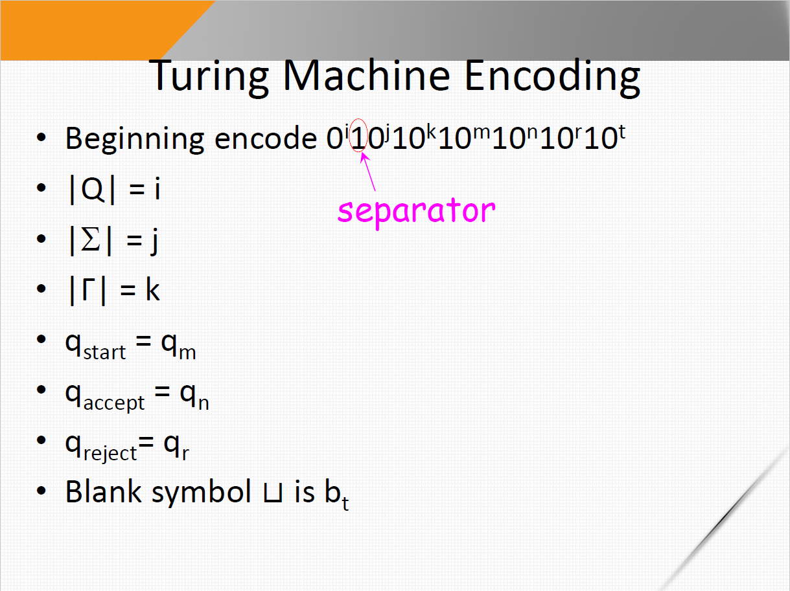
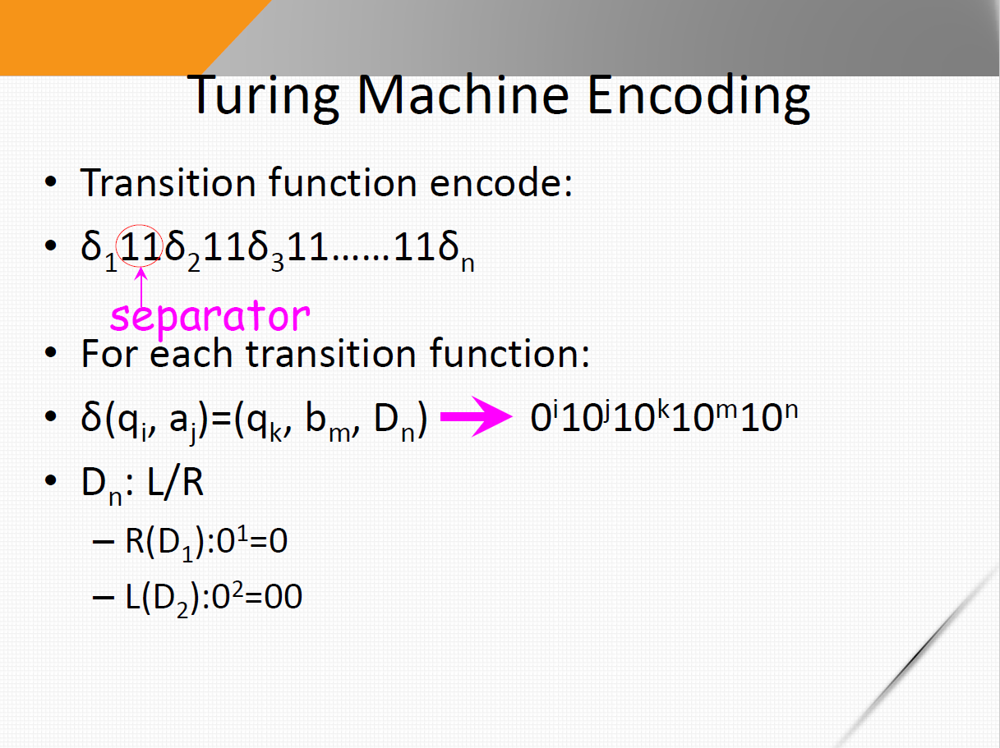

==考试范围==：

* 正则语言						√
* 上下文无关文法			√
* 泵引理 （新）   			√
* 下推自动机 （新）	   √
* 可判定语言 （新）       √
* 多带图灵机 （新）       √
* DFA                                √
* NFA                                √
* 图灵机                            √
* 图灵机编码                    √
* P、NP、NPC 问题，时间复杂性

#### 1 正则语言与自动机

**NFA 转 DFA**，以下题为例

* 状态集：原NFA中，状态集合的所有子集构成的集合。如NFA状态集{1,2,3}，则DFA的状态集{$\O$,{1},{2},{3},{1,2},{1,3},{2,3},{1,2,3}}

* 起始状态：从NFA的起始状态出发，沿着$\epsilon$箭头能够到达的所有状态，加上起始状态本身。如NFA起始状态为1，沿着$\epsilon$能够到达3，故DFA的起始状态为{1,3}

* 接受状态集：包含NFA所有接受状态集中元素的DFA的状态构成的集合。如NFA的接受状态集为{1}，则DFA的接受状态集为{{1},{1,2},{1,3},{1,2,3}}

* 转移函数：书上讲的很乱，这里用 $\epsilon$-closure 闭包来求一个标准解。

  - 首先构造NFA的状态转移表：

    |      | a      | b    |
    | ---- | ------ | ---- |
    | 1    | $\O$   | {2}  |
    | 2    | {2, 3} | {3}  |
    | 3    | {1}    | $\O$ |
  
  * 求出NFA各状态 $\epsilon$-closure 闭包，$\epsilon$-closure(q) 表示状态 q 通过 $\epsilon$ 边能够转移到的状态集合
  
    $\epsilon$-closure( 1 ) = {1, 3}
  
    $\epsilon$-closure( 2 ) = {2}
  
    $\epsilon$-closure( 3 ) = {3}
  
  * 对每个状态，求出在所有输入符号下的转移状态，并对这个状态求闭包，其意义为：某个状态在该输入符号下转移到这个闭包对应的状态 
  
    ***先做转移，再闭包！！！***
  
    （其实从NFA的起始状态开始推，只对每个出现过的（可以转移到的）状态求就可以了，像对{1}、{1,2}求就没有必要，为了完整这里补充上了，这里 O 表示 $\O$，e表示$\epsilon$-closure，作用在集合上就是对作用于元素的并集）
  
    * ({1}, a) => O,    e(  O ）= O    *（没用）* 
  
      ({1}, b) => {2},    e(  {2} ）= {2}   *（没用）* 
  
    * ({2}, a) => {2,3},    e(  {2,3} ）= {2,3}
  
      ({2}, b) => {3},    e(  {3} ）= {3}
  
    * ({3}, a) => {1},    e( {1} ) = {1, 3}
  
      ({3}, b) => O,    e( O ) = O
  
    * ({1, 2}, a) => {2, 3},    e( {2, 3} ) = {2, 3}   *（没用）* 
  
      ({1, 2}, b) => {2, 3},    e( {2, 3} ) = {2, 3}   *（没用）* 
  
    * ({1, 3}, a) => {1},    e( {1} ) = {1, 3}
  
      ({1, 3}, b) => {2},    e( {2} ) = {2}
  
    * ({2, 3}, a) => {1, 2, 3},    e(  {1,2,3} ）= {1,2,3}
  
      ({2, 3}, a) => {3},    e(  {3} ）= {3}
  
    * ({1, 2, 3}, a) => {1, 2, 3},    e(  {1,2,3} ）= {1,2,3}
  
      ({1, 2, 3}, b) => {2, 3},    e(  {2,3} ）= {2,3}
  
    * (O, a) => O,    e(  O ）= O
  
      (O, b) => O,    e(  O ）= O
  
  * 根据状态转移，我们可以画图
  
    
  
    
  
  * 删掉没用的（不会转移到的）状态
  
    

**DFA 转 RE**

广义非确定型有穷自动机（GNFA）

加入新的起始状态 s ，用空边指向原来的起始状态；新的接受状态 a，将所有原来的接受状态都用空边指向 a。

删点t，若某个状态 p 经过该状态t到达另一个状态 q ，则加入一条p到q的转移，中间是在t上经过的正则表达式组合；若原来已经存在这个转移，则用∪合并。（刷题找感觉）

(a|bba)* ba(aa* b)* a|e

**RE 转 NFA**

有一点点像汤普森算法（Project 1）

（刷题找感觉）

#### 2 上下文无关文法

能够用上下文无关文法生成的语言称为 *上下文无关语言*

**定义2.4**：如果字符串 w 在上下文无关文法 G 中有两个或两个以上不同的最左派生，则称 G 歧义地产生字符串 w；如果 G 歧义地产生某个字符串，则称 G 是歧义的。

乔姆斯基范式：

* 形式：$A \to BC$，$A \to a$；
* 构造：
  - 在规则集中加入 $S_0 \to S$
  - 如果 $A \to \epsilon$ ，对每一个右边有 $A$ 的，都加入用空替换的新规则（原来的也是保留的）；对有多个 $A$ 的，考虑每一种可能
  - 如果 $B\to A$ 这种单推，修改为 $B \to u$ ，$u$ 是所有 $A$ 能推出来的 （如果有 $C \to C$ 这种，为了简化可以直接删掉，不会影响结果的）
  - 检查并拆分和修改每一项，得到符合乔姆斯基范式的格式

**==下推自动机 PDA==**（考）

**CFG转PDA**

* 先构造一个基础模板，有 3 部分 $q_{start},q_{loop},q_{accept}$，2 条边，如图：

  

* 然后给 $q_{loop}$ 加个自环，并将所有的产生式 $A \to w$ 改写成 $\epsilon,A \to w$ 写到上面，然后将所有终结符 $a,a \to \epsilon$ 写到上面，如图：

  

* 而后，将每个长度 $|u| > 1$ 的 $u$ 按下图的方式拆成几个状态（表示一次往栈里放了多个符号）： 

  例如，这里 $q$ 和 $r$ 都表示 $q_{loop}$，$a$ 为 $\epsilon$，$s$ 为 $A$，$xyz$ 为长度大于 $1$ 的 $u$

  

**==泵引理==**（考）

* **RE的泵引理：**若 $A$ 是一个正则语言，则存在一个数 $p$（泵长度）使得：如果 $s$ 是 $A$ 中任一长度不小于 $p$ 的字符串，那么 $s$ 可以被分成 $3$ 段 $s=xyz$，满足下述条件：
  1. 对每一个 $i \ge 0$，$xy^iz \in A$
  2. $|y| > 0$
  3. $|xy| \le p$
* **CFG的泵引理：**若 $A$ 是一个上下文无关语言，则存在一个数 $p$（泵长度）使得：如果 $s$ 是 $A$ 中任一长度不小于 $p$ 的字符串，那么 $s$ 可以被分成 $5$ 段 $s=uvxyz$，满足下述条件：
  1. 对每一个 $i \ge 0$，$uv^ixy^iz \in A$
  2. $|vy| > 0$
  3. $|vxy| \le p$

#### 3 图灵机

==多带图灵机==

#### 4 可判定性

**==可判定语言（证明）==**：

* $A_{DFA}$ 是一个可判定语言

  构造TM，在输入w上模拟DFA。首先检查输入是不是正确表示了一个合理的DFA（5个元素）和一个串w，如果不是则拒绝；然后TM执行模拟，当处理完w最后一个字符时，若DFA接受则接收，否则拒绝。

* $A_{NFA}$ 是一个可判定语言

  将NFA转换为DFA，运行上述DFA的TM

* $A_{REX}$ 是一个可判定语言

  将REX转换为等价的NFA，运行上述NFA的TM

* $E_{DFA}$ 是一个可判定语言

  构造TM，标记起始状态。从起始状态出发，重复以下步骤，直到找不到可以做标记的状态：对于一个状态，如果有一个到达他的状态是从被标记过的状态出发的，则将他标记。如果没有接受状态被标记，则接受，否则拒绝。

* $EQ_{DFA}$ 是一个可判定语言

  构造由两个输入的DFA构造一个新的DFA，他是两个DFA的对称差（即A接受B不接受，和A不接受B接受的并集），在 E_{DFA} 上运行，若接受则接受，否则拒绝

* $A_{CFG}$ 是一个可判定语言

  将G转换为乔姆斯基范式，列出所有2n-1步的派生，n是w的长度（若n=0，则列出一步以内的派生）。如果这些派生中有一个产生w，则接受，否则拒绝

* $E_{CFG}$ 是一个可判定语言

  构造TM，给所有终结符做上标记。重复以下步骤，直到没有可以做标记的变元：如果有产生式 $A \to U_1U_2...Uk$，且右边都被标记过，则标记 A。如果起始状态没有被标记，则接受，否则拒绝。 

* 每个上下文无关语言都是可判定的

  *这句话的意思是，存在一个TM M，M(w) = accept 当且仅当 w 属于上下文无关语言 L 且总能停机，并不是说要把这个语言中所有的字符串全跑一遍（行不通）。*

  设 G 是这个语言 L 的一个文法，用 G 的判定器判定即可

**停机问题**

* $A_{TM}$ 是不可判定的

  构造一个通用图灵机U来判定M，在M上模拟输入串w，若M接受则接受，若M拒绝则拒绝，若M循环则无法判定。

  推论：存在不能被任何图灵机识别的语言（不可数的）

  定理：一个语言是可判定的，当且仅当他是图灵可识别的，也是补图灵可识别的

  推论：$\overline {A_{TM} }$ 不是图灵可识别的

**==图灵机编码==**

#### 5 可归约性

定理：

* $HALT_{TM}$ 是不可判定的

* $E_{TM}$ 是不可判定的

* $REGULAR_{TM}$ 是不可判定的

* $EQ_{TM}$ 是不可判定的

* $A_{LBA}$ 是**可**判定的

  设M是LBA，如果M重复过一个格局，说明存在循环。假设最大格局数为k，则通过模拟k步，如果M还没有停机则进入了循环，于是拒绝；其他情况M接受则接受，M拒绝则拒绝。

* $E_{LBA}$ 是不可判定的

* $ALL_{CFG}$ 是不可判定的

* $EQ_{CFG}$ 是不可判定的

若 $A\le_m B$，且 $B$ 是可判定的，则 $A$ 也是可判定的

若 $A\le_m B$，且 $A$ 是不可判定的，则 $B$ 也是不可判定的

线性界限自动机（LBA）：有限存储的图灵机

引理：设 M 是有 q 个状态和 g 个带符号的 LBA，对于长度为 n 的带子，M 恰有 $qng^n$ 个不同的格局（最大格局数）

#### 7 时间复杂度

大O记法

分析算法的时间复杂度

单带图灵机在o(nlogn)时间内判定的语言都是正则语言

语言A的时间复杂度（即判定A需要的时间）与选择的计算模型（算法）有关。在可计算理论中，丘奇-图灵论题断言，所有合理的计算模型都是等价的；在复杂性理论中，模型的选择影响语言的时间复杂度

**定理7.8**：设 $t(n)$ 是一个函数，$t(n) \ge n$，则每一个 $t(n)$ 时间的**多带图灵机**都和某一个 $O(t^2(n))$ 的单带图灵机等价

**定理7.10**：设 $t(n)$ 是一个函数，$t(n) \ge n$，则每一个 $t(n)$ 时间的**非确定型单带图灵机**都和某一个 $2^{O(t(n))}$ 的确定型单带图灵机等价